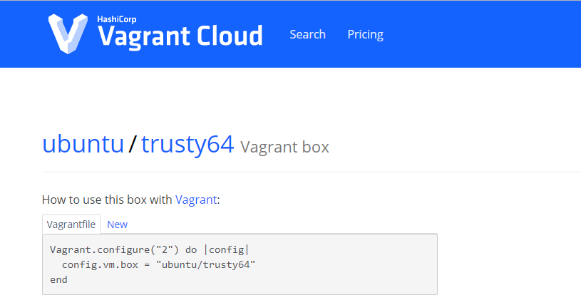

# vagrant使用

- 官网 https://www.vagrantup.com/
- 下载 https://www.vagrantup.com/downloads.html
- 安装完成后查看版本，判断是否安装完成

```bash
D:\>vagrant version
Installed Version: 2.2.7
Latest Version: 2.2.7
```


## 安装centos

- 在指定目录下创建系统，生成一个vagrantfile文件

```bash
D:\VM-BOX-OS\centos7>vagrant init centos/7
```

- 下载并启动相应的box文件（可看成iso文件）

```bash
D:\VM-BOX-OS\centos7>vagrant up
Bringing machine 'default' up with 'hyperv' provider...
==> default: Verifying Hyper-V is enabled...
==> default: Verifying Hyper-V is accessible...
==> default: Box 'centos/7' could not be found. Attempting to find and install...
    default: Box Provider: hyperv
    default: Box Version: >= 0
==> default: Loading metadata for box 'centos/7'
    default: URL: https://vagrantcloud.com/centos/7
==> default: Adding box 'centos/7' (v1905.1) for provider: hyperv
    default: Downloading: https://vagrantcloud.com/centos/boxes/7/versions/1905.1/providers/hyperv.box
    default: Download redirected to host: cloud.centos.org
    default:
==> default: Successfully added box 'centos/7' (v1905.1) for 'hyperv'!
==> default: Importing a Hyper-V instance
    default: Creating and registering the VM...
    default: Successfully imported VM
    default: Configuring the VM...
==> default: Starting the machine...
==> default: Waiting for the machine to report its IP address...
    default: Timeout: 120 seconds
    default: IP: 172.31.28.51
==> default: Waiting for machine to boot. This may take a few minutes...
    default: SSH address: 172.31.28.51:22
    default: SSH username: vagrant
    default: SSH auth method: private key
    default:
    default: Vagrant insecure key detected. Vagrant will automatically replace
    default: this with a newly generated keypair for better security.
    default:
    default: Inserting generated public key within guest...
    default: Removing insecure key from the guest if it's present...
    default: Key inserted! Disconnecting and reconnecting using new SSH key...
==> default: Machine booted and ready!
```


## 登录进入centos

- 安装完成后就已经启动了centos镜像

- 进入到虚拟机中

```bash
Administrator@PC-201902252208 MINGW64 /d/VM-BOX-OS/centos7
$ vagrant ssh
[vagrant@localhost ~]$ sudo yum update # 可以执行更新

```


## 退出登录centos

```bash
[vagrant@localhost ~]$ exit
logout
Connection to 172.31.28.51 closed.
```


## 查看centos状态

```bash
Administrator@PC-201902252208 MINGW64 /d/VM-BOX-OS/centos7
$ vagrant status
Current machine states:
# hostname                正在运行
default                   running (hyperv)
```


## 关闭centos

```bash
Administrator@PC-201902252208 MINGW64 /d/VM-BOX-OS/centos7
$ vagrant halt
==> default: Attempting graceful shutdown of VM...

Administrator@PC-201902252208 MINGW64 /d/VM-BOX-OS/centos7
$ vagrant status
Current machine states:

default                   off (hyperv)
```

- 如果想再启动可以使用vagrant up命令

## 删除centos

```bash
vagrant destroy
```


# vagrantfile

- 可以通过 https://app.vagrantup.com/boxes/search 查询支持的box镜像
- 通过vagrantfile可以同时创建多台linux主机

- 如ubuntu的vagrantfile的书写

 


# virtualBox使用

下载地址 https://www.virtualbox.org/wiki/Downloads

- 注意 vagrant 的2.2.7版本与virtualBox的6.x版本不兼容，使用virtualBox5.2.22版本