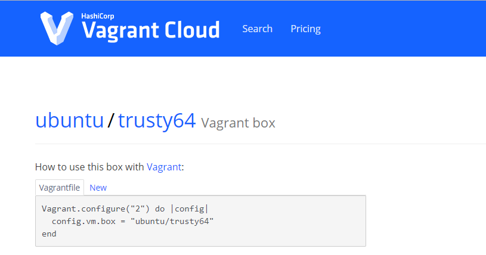

# 资料路径

Vagrant下载 https://www.vagrantup.com/downloads.html

Virtualbox 5.1下载 https://www.virtualbox.org/wiki/Download_Old_Builds_5_1

Docker国内源安装 https://get.daocloud.io/#install-docker

Docker官方网站 https://www.docker.com/

Docker官方文档中心 https://docs.docker.com/

DockerHub https://hub.docker.com/


# vagrant使用

- 官网 https://www.vagrantup.com/
- 下载 https://www.vagrantup.com/downloads.html
- 安装完成后查看版本，判断是否安装完成

```bash
D:\>vagrant version
Installed Version: 2.2.7
Latest Version: 2.2.7
```


## 安装centos

- 在指定目录下创建系统，生成一个vagrantfile文件

```bash
D:\VM-BOX-OS\centos7>vagrant init centos/7
```

- 下载并启动相应的box文件（可看成iso文件）

```bash
D:\VM-BOX-OS\centos7>vagrant up
Bringing machine 'default' up with 'hyperv' provider...
==> default: Verifying Hyper-V is enabled...
==> default: Verifying Hyper-V is accessible...
==> default: Box 'centos/7' could not be found. Attempting to find and install...
    default: Box Provider: hyperv
    default: Box Version: >= 0
==> default: Loading metadata for box 'centos/7'
    default: URL: https://vagrantcloud.com/centos/7
==> default: Adding box 'centos/7' (v1905.1) for provider: hyperv
    default: Downloading: https://vagrantcloud.com/centos/boxes/7/versions/1905.1/providers/hyperv.box
    default: Download redirected to host: cloud.centos.org
    default:
==> default: Successfully added box 'centos/7' (v1905.1) for 'hyperv'!
==> default: Importing a Hyper-V instance
    default: Creating and registering the VM...
    default: Successfully imported VM
    default: Configuring the VM...
==> default: Starting the machine...
==> default: Waiting for the machine to report its IP address...
    default: Timeout: 120 seconds
    default: IP: 172.31.28.51
==> default: Waiting for machine to boot. This may take a few minutes...
    default: SSH address: 172.31.28.51:22
    default: SSH username: vagrant
    default: SSH auth method: private key
    default:
    default: Vagrant insecure key detected. Vagrant will automatically replace
    default: this with a newly generated keypair for better security.
    default:
    default: Inserting generated public key within guest...
    default: Removing insecure key from the guest if it's present...
    default: Key inserted! Disconnecting and reconnecting using new SSH key...
==> default: Machine booted and ready!
```


## 登录进入centos

- 安装完成后就已经启动了centos镜像

- 进入到虚拟机中

```bash
Administrator@PC-201902252208 MINGW64 /d/VM-BOX-OS/centos7
$ vagrant ssh
[vagrant@localhost ~]$ sudo yum update # 可以执行更新

```


## 退出登录centos

```bash
[vagrant@localhost ~]$ exit
logout
Connection to 172.31.28.51 closed.
```


## 查看centos状态

```bash
Administrator@PC-201902252208 MINGW64 /d/VM-BOX-OS/centos7
$ vagrant status
Current machine states:
# hostname                正在运行
default                   running (hyperv)
```


## 关闭centos

```bash
Administrator@PC-201902252208 MINGW64 /d/VM-BOX-OS/centos7
$ vagrant halt
==> default: Attempting graceful shutdown of VM...

Administrator@PC-201902252208 MINGW64 /d/VM-BOX-OS/centos7
$ vagrant status
Current machine states:

default                   off (hyperv)
```

- 如果想再启动可以使用vagrant up命令

## 删除centos

```bash
vagrant destroy
```


# vagrantfile

- 可以通过 https://app.vagrantup.com/boxes/search 查询支持的box镜像
- 通过vagrantfile可以同时创建多台linux主机

- 如ubuntu的vagrantfile的书写

 


# vagrant存储box的目录

add box的时候默认保存在C盘用户文件夹 C:\Users\xxx.vagrant.d，通过设置VAGRANT_HOME环境变量改变默认位置

setx VAGRANT_HOME “X:/your/path”
setx VAGRANT_HOME “X:/your/path” /M （系统变量）


# virtualBox使用

下载地址 https://www.virtualbox.org/wiki/Downloads

- 注意 vagrant 的2.2.7版本与virtualBox的6.x版本不兼容，使用virtualBox5.2.22版本


# vagrant 问题处理


## window下启动失败

```bash
$ vagrant up
Bringing machine 'default' up with 'virtualbox' provider...
==> default: Box 'centos/7' could not be found. Attempting to find and install...
    default: Box Provider: virtualbox
    default: Box Version: >= 0
==> default: Loading metadata for box 'centos/7'
    default: URL: https://vagrantcloud.com/centos/7
==> default: Adding box 'centos/7' (v1905.1) for provider: virtualbox
    default: Downloading: https://vagrantcloud.com/centos/boxes/7/versions/1905.1/providers/virtualbox.box
    default: Download redirected to host: cloud.centos.org
    default:
==> default: Successfully added box 'centos/7' (v1905.1) for 'virtualbox'!
==> default: Importing base box 'centos/7'...
==> default: Matching MAC address for NAT networking...
==> default: Checking if box 'centos/7' version '1905.1' is up to date...
==> default: Setting the name of the VM: centos7_default_1586422101158_49764
==> default: Clearing any previously set network interfaces...
==> default: Preparing network interfaces based on configuration...
    default: Adapter 1: nat
==> default: Forwarding ports...
    default: 22 (guest) => 2222 (host) (adapter 1)
==> default: Booting VM...
There was an error while executing `VBoxManage`, a CLI used by Vagrant
for controlling VirtualBox. The command and stderr is shown below.

Command: ["startvm", "8ac386aa-0de6-4e87-a6c3-4b53a3fda7ed", "--type", "headless"]

Stderr: VBoxManage.exe: error: VMMR0_DO_NEM_INIT_VM failed: VERR_NEM_MISSING_KERNEL_API (VERR_NEM_MISSING_KERNEL_API).
VBoxManage.exe: error: VT-x is not available (VERR_VMX_NO_VMX)
VBoxManage.exe: error: Details: code E_FAIL (0x80004005), component ConsoleWrap, interface IConsole
```

window下需要关闭的服务，如果有的话

- Hyper-V
- Virtual Machine Platform
- Windows Hypervisor platform
- **Containers**


## 关于超时

```bash
$ vagrant up
Bringing machine 'default' up with 'virtualbox' provider...
==> default: Checking if box 'centos/7' version '1905.1' is up to date...
==> default: Clearing any previously set forwarded ports...
==> default: Clearing any previously set network interfaces...
==> default: Preparing network interfaces based on configuration...
    default: Adapter 1: nat
==> default: Forwarding ports...
    default: 22 (guest) => 2222 (host) (adapter 1)
==> default: Booting VM...
==> default: Waiting for machine to boot. This may take a few minutes...
    default: SSH address: 127.0.0.1:2222
    default: SSH username: vagrant
    default: SSH auth method: private key
Timed out while waiting for the machine to boot. This means that
Vagrant was unable to communicate with the guest machine within
the configured ("config.vm.boot_timeout" value) time period.

If you look above, you should be able to see the error(s) that
Vagrant had when attempting to connect to the machine. These errors
are usually good hints as to what may be wrong.

If you're using a custom box, make sure that networking is properly
working and you're able to connect to the machine. It is a common
problem that networking isn't setup properly in these boxes.
Verify that authentication configurations are also setup properly,
as well.

If the box appears to be booting properly, you may want to increase
the timeout ("config.vm.boot_timeout") value.
```

- 通过版本解决，当前使用6.1.0版本失败，更换5.2.16成功
- 


# 关于vagrant 镜像

- 清华大学 https://mirrors.tuna.tsinghua.edu.cn/ubuntu-cloud-images/vagrant/trusty/current/
