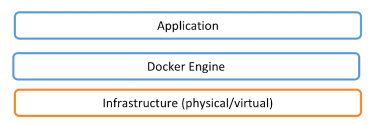

# Docker Platform

- docker 提供了一个开发，打包，运行app的平台
- 把app和底层infrastructure隔离开来

 


# Docker Engine

- 核心组件
  - 后台进程
    - dockerd
  - REST API Server
  - CLI接口
    - docker

  

- 查看进程

```bash
[vagrant@localhost ~]$ ps -ef | grep docker
root     23235     1  0 Apr09 ?        00:00:02 /usr/bin/dockerd -H fd:// --containerd=/run/containerd/containerd.sock # 看到dockerd在运行
vagrant  23799  4319  0 03:07 pts/0    00:00:00 grep --color=auto docker

```


# Docker 架构

- docker daemon 就是dockerd
  - 负责containers，images的管理和启动维护工作
- client 可以和docker host在一台机器上，也可以在不同的机器上

 

## linux的底层技术支持

- Namespaces：做隔离pid，net，ipc，mnt，uts
  - 可以启动多个容器，对pid等多个系统资源做隔离
- Control groups：做资源限制
  - 对容器的资源做控制
- Union file systems：Container和image的分层