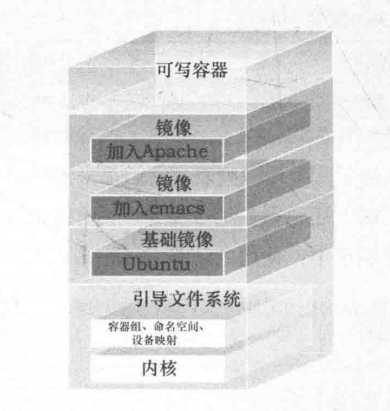

# Image


## 概念

 

- 镜像文件都是只读的
- 创建容器后会将镜像文件加载到容器中，并创建一个可写容器层
- 当对底层镜像的一个文件需要进行修改，那么会拷贝一个到容器层进行修改
  - 写时复制机制
- 每次读取文件从容器层开始，一层一层获取


- 文件和meta data的集合 root filesystem
- 分层的，每一层都可以添加改变删除文件，成为一个新image
- 不同的image可以共享相同的layer
- image本身是read-only的

 

- 给予base image 之上安装软件，形成新的image
- 不同的image可以共享其他image

- 获取image


 


# 查看image

```bash
[vagrant@docker-host labs]$ sudo docker image ls
REPOSITORY          TAG                 IMAGE ID            CREATED             SIZE
hello-world         latest              fce289e99eb9        15 months ago       1.84kB
```


# 拉取image

- 从dockerhub上拉取

```bash
[vagrant@docker-host labs]$ sudo docker pull centos
```


# 创建image

- 编写一个hello.c文件

```bash
#include<stdio.h>

int main()
{
   printf("hello docker\n");
}
```

- 编译&执行

```bash
[vagrant@docker-host hello-world]$ gcc -static hello.c -o hello
[vagrant@docker-host hello-world]$ ./hello
hello docker
```

- 编写Dockerfile

```bash
FROM scratch # 使用一个空镜像
ADD hello /
CMD ["/hello"]
```

- 创建image
  - . 表示从读取当前目录的Dockerfile
  - -t 指定一个tag，stt/hello-world

```bash
[vagrant@docker-host hello-world]$ docker build -t stt/hello-world .
Sending build context to Docker daemon  857.1kB
Step 1/3 : FROM scratch
 --->
Step 2/3 : ADD hello /
 ---> 7fceee8474ab
Step 3/3 : CMD ["/hello"]
 ---> Running in ccf86db6bdb3
Removing intermediate container ccf86db6bdb3
 ---> 9a67ab280ca4
Successfully built 9a67ab280ca4
Successfully tagged stt/hello-world:latest

[vagrant@docker-host hello-world]$ docker run stt/hello-world
hello docker
```


# 查看image的分层结构

```bash
[vagrant@docker-host hello-world]$ docker image ls
REPOSITORY          TAG                 IMAGE ID            CREATED             SIZE
stt/hello-world     latest              9a67ab280ca4        31 seconds ago      844kB
centos              latest              470671670cac        2 months ago        237MB
hello-world         latest              fce289e99eb9        15 months ago       1.84kB
# 查询得到image 的id，后查询分层的详细结果
[vagrant@docker-host hello-world]$ docker history 9a67ab280ca4
IMAGE               CREATED              CREATED BY                                      SIZE                COMMENT
9a67ab280ca4        About a minute ago   /bin/sh -c #(nop)  CMD ["/hello"]               0B # 第二层添加执行命令
7fceee8474ab        About a minute ago   /bin/sh -c #(nop) ADD file:277ca2e4013da55b0…   844kB # 第一层添加文件
```


# 构建自己的镜像


## 方式1：通过现有的container创建

- 基于现有的container进行构建
  - 如在容器中添加vim功能

```bash
[vagrant@docker-host hello-world]$ docker image ls
REPOSITORY          TAG                 IMAGE ID            CREATED             SIZE
stt/hello-world     latest              9a67ab280ca4        45 minutes ago      844kB
centos              latest              470671670cac        2 months ago        237MB
hello-world         latest              fce289e99eb9        15 months ago       1.84kB
[vagrant@docker-host hello-world]$ docker run -it centos
[root@ff6e01ca8256 /]# yum install -y vim
...
[vagrant@docker-host hello-world]$ docker container ls -a
CONTAINER ID        IMAGE               COMMAND             CREATED             STATUS                      PORTS               NAMES
ff6e01ca8256        centos              "/bin/bash"         51 minutes ago      Exited (0) 11 seconds ago                       stupefied_jepsen
# 对现有的container创建镜像
# docker commit 容器的名称 镜像的tag
[vagrant@docker-host hello-world]$ docker commit stupefied_jepsen stt/centos-vim
sha256:2bb9fe3d43d60d88871ffc7967a80ec9b2ed36648bb8b11ae4a28c3fe5e73385
# 查看生成的镜像
[vagrant@docker-host hello-world]$ docker image ls -a
REPOSITORY          TAG                 IMAGE ID            CREATED             SIZE
stt/centos-vim      latest              2bb9fe3d43d6        49 seconds ago      301MB
centos              latest              470671670cac        2 months ago        237MB

```

- 分析：查看分层信息

```bash
[vagrant@docker-host hello-world]$ docker history 470671670cac
IMAGE               CREATED             CREATED BY                                      SIZE                COMMENT
470671670cac        2 months ago        /bin/sh -c #(nop)  CMD ["/bin/bash"]            0B
<missing>           2 months ago        /bin/sh -c #(nop)  LABEL org.label-schema.sc…   0B
<missing>           2 months ago        /bin/sh -c #(nop) ADD file:aa54047c80ba30064…   237MB

# 查看新建的镜像，可以看到是基于470671670cac镜像而来的
[vagrant@docker-host hello-world]$ docker history 2bb9fe3d43d6
IMAGE               CREATED             CREATED BY                                      SIZE                COMMENT
2bb9fe3d43d6        3 minutes ago       /bin/bash                                       63.5MB
470671670cac        2 months ago        /bin/sh -c #(nop)  CMD ["/bin/bash"]            0B
<missing>           2 months ago        /bin/sh -c #(nop)  LABEL org.label-schema.sc…   0B
<missing>           2 months ago        /bin/sh -c #(nop) ADD file:aa54047c80ba30064…   237MB
```

- 该方式的缺点
  - container中安装的程序不明确，可能有风险


## 方式2：通过Dockerfile创建

- 编写Dockerfile

```bash
[vagrant@docker-host opt]$ sudo mkdir docker-centos-vim
[vagrant@docker-host opt]$ cd docker-centos-vim/
[vagrant@docker-host docker-centos-vim]$ sudo vim Dockerfile
[vagrant@docker-host docker-centos-vim]$ cat vim Dockerfile
FROM centos
RUN yum install -y vim
```

- 构建镜像
  - 启动临时容器，进行操作，然后构建新镜像后删除启动的临时容器

```bash
# 基于当前目录构建一个镜像
[vagrant@docker-host docker-centos-vim]$ docker build -t stt/centos-vim-new .
[vagrant@docker-host docker-centos-vim]$ docker build -t stt/centos-vim-new .
Sending build context to Docker daemon  2.048kB
Step 1/2 : FROM centos
 ---> 470671670cac # 直接拉取一个centos镜像
Step 2/2 : RUN yum install -y vim # 开始安装vim软件
 ---> Running in 1d185532de45 # 开启一个容器进行vim的安装
CentOS-8 - AppStream                            728 kB/s | 6.6 MB     00:09
...
Removing intermediate container 1d185532de45 # 删除临时容器
 ---> e72ebf5b9186 #基于临时容器，进行build commit 生成的新镜像
Successfully built e72ebf5b9186
Successfully tagged stt/centos-vim-new:latest
```


## 原理

- 读取Dockerfile每一条命令时，构建一个镜像，并在此镜像基础上启动一个临时容器
- 对临时容器执行下一条配置命令，再生成一个镜像，删除原先的容器，启动新容器进行修改
- 最终生成一个最终镜像


# 镜像发布

- 将镜像发布在dockerhub上

- https://hub.docker.com/repositories
- 注册账号，登录

```bash
[vagrant@docker-host hello-world]$ docker login
[vagrant@docker-host hello-world]$ docker push shetengteng2019/hello-world:latest
```

- push成功后，可以看到镜像

 

- 推荐方式：将github和dockerhub进行关联，然后上传到github的dockerfile会自动编译为镜像文件


## 搭建私有github仓库

repository