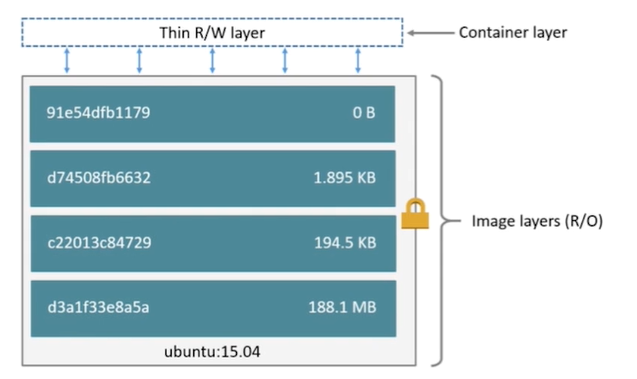

# container

- 通过Image创建（copy）
- 在Image layer之上建立一个container layer（可读写）
- 类比面向对象：类和实例
- Image负责app的存储和分发
- Container负责运行app

 


# 查看容器列表

- ls可以查看在当前运行的容器
- ls -a 可以看到所有的容器

```bash
[vagrant@docker-host hello-world]$ docker container ls
CONTAINER ID        IMAGE               COMMAND             CREATED             STATUS              PORTS               NAMES
[vagrant@docker-host hello-world]$ docker container ls -a
CONTAINER ID        IMAGE               COMMAND             CREATED             STATUS                       PORTS               NAMES
f66775b02c02        stt/hello-world     "/hello"            21 minutes ago      Exited (13) 21 minutes ago                       agitated_roentgen
51eb280d4e6e        hello-world         "/hello"            46 minutes ago      Exited (0) 46 minutes ago                        serene_vaughan
```

- 获取id

```bash
[vagrant@docker-host hello-world]$ docker container ls -aq
c7287a534cd6
f66775b02c02
51eb280d4e6e
# 等价于
[vagrant@docker-host hello-world]$ docker container ls -a | awk {'print$1'}
CONTAINER
c7287a534cd6
f66775b02c02
51eb280d4e6e
```


# 交互式运行容器

```bash
[vagrant@docker-host hello-world]$ docker run -it centos
[root@c7287a534cd6 /]# ls
bin  dev  etc  home  lib  lib64  lost+found  media  mnt  opt  proc  root  run  sbin  srv  sys  tmp  usr  var
```


# docker 命令

```bash
Management Commands: 
  builder     Manage builds
  config      Manage Docker configs
  container   Manage containers
  context     Manage contexts
  engine      Manage the docker engine
  image       Manage images
  network     Manage networks
  node        Manage Swarm nodes
  plugin      Manage plugins
  secret      Manage Docker secrets
  service     Manage services
  stack       Manage Docker stacks
  swarm       Manage Swarm
  system      Manage Docker
  trust       Manage trust on Docker images
  volume      Manage volumes

Commands: # 命令的简化操作
  attach      Attach local standard input, output, and error streams to a running container
  build       Build an image from a Dockerfile
  commit      Create a new image from a container's changes
  cp          Copy files/folders between a container and the local filesystem
  create      Create a new container
  diff        Inspect changes to files or directories on a container's filesystem
  events      Get real time events from the server
  exec        Run a command in a running container
  export      Export a container's filesystem as a tar archive
  history     Show the history of an image
  images      List images
  import      Import the contents from a tarball to create a filesystem image
  info        Display system-wide information
  inspect     Return low-level information on Docker objects
  kill        Kill one or more running containers
  load        Load an image from a tar archive or STDIN
  login       Log in to a Docker registry
  logout      Log out from a Docker registry
  logs        Fetch the logs of a container
  pause       Pause all processes within one or more containers
  port        List port mappings or a specific mapping for the container
  ps          List containers
  pull        Pull an image or a repository from a registry
  push        Push an image or a repository to a registry
  rename      Rename a container
  restart     Restart one or more containers
  rm          Remove one or more containers
  rmi         Remove one or more images
  run         Run a command in a new container
  save        Save one or more images to a tar archive (streamed to STDOUT by default)
  search      Search the Docker Hub for images
  start       Start one or more stopped containers
  stats       Display a live stream of container(s) resource usage statistics
  stop        Stop one or more running containers
  tag         Create a tag TARGET_IMAGE that refers to SOURCE_IMAGE
  top         Display the running processes of a container
  unpause     Unpause all processes within one or more containers
  update      Update configuration of one or more containers
  version     Show the Docker version information
  wait        Block until one or more containers stop, then print their exit codes
```

- 通过container可以看到container的命令

```bash
[vagrant@docker-host hello-world]$ docker container

Usage:  docker container COMMAND

Manage containers

Commands:
  attach      Attach local standard input, output, and error streams to a running container
  commit      Create a new image from a container's changes
  cp          Copy files/folders between a container and the local filesystem
  create      Create a new container
  diff        Inspect changes to files or directories on a container's filesystem
  exec        Run a command in a running container
  export      Export a container's filesystem as a tar archive
  inspect     Display detailed information on one or more containers
  kill        Kill one or more running containers
  logs        Fetch the logs of a container
  ls          List containers
  pause       Pause all processes within one or more containers
  port        List port mappings or a specific mapping for the container
  prune       Remove all stopped containers
  rename      Rename a container
  restart     Restart one or more containers
  rm          Remove one or more containers
  run         Run a command in a new container
  start       Start one or more stopped containers
  stats       Display a live stream of container(s) resource usage statistics
  stop        Stop one or more running containers
  top         Display the running processes of a container
  unpause     Unpause all processes within one or more containers
  update      Update configuration of one or more containers
  wait        Block until one or more containers stop, then print their exit codes
```

- --help更加细粒度的查看命令

```bash
[vagrant@docker-host hello-world]$ docker container ls --help

Usage:  docker container ls [OPTIONS]

List containers

Aliases:
  ls, ps, list

Options:
  -a, --all             Show all containers (default shows just running)
  -f, --filter filter   Filter output based on conditions provided
      --format string   Pretty-print containers using a Go template
  -n, --last int        Show n last created containers (includes all states) (default -1)
  -l, --latest          Show the latest created container (includes all states)
      --no-trunc        Don't truncate output
  -q, --quiet           Only display numeric IDs
  -s, --size            Display total file sizes
```


# 启动容器

- 如果启动时带上name，那么在stop和start命令可以直接使用name的值

```bash
docker run -d --name=demo xxx
```


# 删除容器 docker container rm

- 删除容器可以直接调用id删除
- 如果删除多个容器，可以使用如下命令

```bash
[vagrant@docker-host hello-world]$ docker rm $(docker container ls -aq)
c7287a534cd6
f66775b02c02
51eb280d4e6e
[vagrant@docker-host hello-world]$ docker container ls -a
```

- 删除指定状态的docker

```bash
docker rm $(docker container ls -f "status=exited" -q)
```


# 停止容器 docker container stop


# 进入运行的容器（重要）docker exec -it

- 可以进入正在运行的容器内进行操作

- 在dockerfile实战中创建的容器

```bash
[vagrant@docker-host test]$ docker container ls
CONTAINER ID        IMAGE                   COMMAND             CREATED             STATUS              PORTS                    NAMES
fb837ec4abc7        stt/flask-hello-world   "python app.py"     4 minutes ago       Up 4 minutes        0.0.0.0:5000->5000/tcp   hungry_jackson
[vagrant@docker-host test]$ docker exec -it fb837ec4abc7 /bin/bash
root@fb837ec4abc7:/app# ls
app.py

root@fb837ec4abc7:~# ps -ef | grep python
root         1     0  0 11:51 ?        00:00:00 python app.py
root        20     9  0 11:57 pts/0    00:00:00 grep python

[vagrant@docker-host test]$ docker exec -it fb837ec4abc7 python
Python 2.7.17 (default, Mar 31 2020, 17:25:23)
[GCC 8.3.0] on linux2
Type "help", "copyright", "credits" or "license" for more information.
>>> print "hello world"
hello world

# 查看容器的ip地址
[vagrant@docker-host test]$ docker exec -it fb837ec4abc7 ip a
1: lo: <LOOPBACK,UP,LOWER_UP> mtu 65536 qdisc noqueue state UNKNOWN group default qlen 1000
    link/loopback 00:00:00:00:00:00 brd 00:00:00:00:00:00
    inet 127.0.0.1/8 scope host lo
       valid_lft forever preferred_lft forever
61: eth0@if62: <BROADCAST,MULTICAST,UP,LOWER_UP> mtu 1500 qdisc noqueue state UP group default
    link/ether 02:42:ac:11:00:02 brd ff:ff:ff:ff:ff:ff link-netnsid 0
    inet 172.17.0.2/16 brd 172.17.255.255 scope global eth0
       valid_lft forever preferred_lft forever
```


# 查看容器的详细信息

```bash
[vagrant@docker-host test]$ docker inspect 9cbdae48641f
[
    {
    # 完整ID
        "Id": "9cbdae48641f8b749ba09e55809c03f852e8cc2a8e6443bd60360534422a5066",
        "Created": "2020-04-10T12:06:56.870550289Z",
        "Path": "python",
        "Args": [
            "app.py"
        ],
        "State": {
            "Status": "running",
            "Running": true,
            "Paused": false,
            "Restarting": false,
            "OOMKilled": false,
            "Dead": false,
            "Pid": 18434,
            "ExitCode": 0,
            "Error": "",
            "StartedAt": "2020-04-10T12:06:57.086308273Z",
            "FinishedAt": "0001-01-01T00:00:00Z"
        },
        "Image": "sha256:1b6b8ba18750a33bb7a7a145631b85bfaf9bcf1552d1807b428e1ee74abbdf24",
        "ResolvConfPath": "/var/lib/docker/containers/9cbdae48641f8b749ba09e55809c03f852e8cc2a8e6443bd60360534422a5066/resolv.conf",
        "HostnamePath": "/var/lib/docker/containers/9cbdae48641f8b749ba09e55809c03f852e8cc2a8e6443bd60360534422a5066/hostname",
        "HostsPath": "/var/lib/docker/containers/9cbdae48641f8b749ba09e55809c03f852e8cc2a8e6443bd60360534422a5066/hosts",
        "LogPath": "/var/lib/docker/containers/9cbdae48641f8b749ba09e55809c03f852e8cc2a8e6443bd60360534422a5066/9cbdae48641f8b749ba09e55809c03f852e8cc2a8e6443bd60360534422a5066-json.log",
        "Name": "/gracious_visvesvaraya",
        "RestartCount": 0,
        "Driver": "overlay2",
        "Platform": "linux",
        "MountLabel": "",
        "ProcessLabel": "",
        "AppArmorProfile": "",
        "ExecIDs": null,
        "HostConfig": {
            "Binds": null,
            "ContainerIDFile": "",
            "LogConfig": {
                "Type": "json-file",
                "Config": {}
            },
            "NetworkMode": "default",
            "PortBindings": {
                "5000/tcp": [
                    {
                        "HostIp": "",
                        "HostPort": "5000"
                    }
                ]
            },
            "RestartPolicy": {
                "Name": "no",
                "MaximumRetryCount": 0
            },
            "AutoRemove": false,
            "VolumeDriver": "",
            "VolumesFrom": null,
            "CapAdd": null,
            "CapDrop": null,
            "Capabilities": null,
            "Dns": [],
            "DnsOptions": [],
            "DnsSearch": [],
            "ExtraHosts": null,
            "GroupAdd": null,
            "IpcMode": "private",
            "Cgroup": "",
            "Links": null,
            "OomScoreAdj": 0,
            "PidMode": "",
            "Privileged": false,
            "PublishAllPorts": false,
            "ReadonlyRootfs": false,
            "SecurityOpt": null,
            "UTSMode": "",
            "UsernsMode": "",
            "ShmSize": 67108864,
            "Runtime": "runc",
            "ConsoleSize": [
                0,
                0
            ],
            "Isolation": "",
            "CpuShares": 0,
            "Memory": 0,
            "NanoCpus": 0,
            "CgroupParent": "",
            "BlkioWeight": 0,
            "BlkioWeightDevice": [],
            "BlkioDeviceReadBps": null,
            "BlkioDeviceWriteBps": null,
            "BlkioDeviceReadIOps": null,
            "BlkioDeviceWriteIOps": null,
            "CpuPeriod": 0,
            "CpuQuota": 0,
            "CpuRealtimePeriod": 0,
            "CpuRealtimeRuntime": 0,
            "CpusetCpus": "",
            "CpusetMems": "",
            "Devices": [],
            "DeviceCgroupRules": null,
            "DeviceRequests": null,
            "KernelMemory": 0,
            "KernelMemoryTCP": 0,
            "MemoryReservation": 0,
            "MemorySwap": 0,
            "MemorySwappiness": null,
            "OomKillDisable": false,
            "PidsLimit": null,
            "Ulimits": null,
            "CpuCount": 0,
            "CpuPercent": 0,
            "IOMaximumIOps": 0,
            "IOMaximumBandwidth": 0,
            "MaskedPaths": [
                "/proc/asound",
                "/proc/acpi",
                "/proc/kcore",
                "/proc/keys",
                "/proc/latency_stats",
                "/proc/timer_list",
                "/proc/timer_stats",
                "/proc/sched_debug",
                "/proc/scsi",
                "/sys/firmware"
            ],
            "ReadonlyPaths": [
                "/proc/bus",
                "/proc/fs",
                "/proc/irq",
                "/proc/sys",
                "/proc/sysrq-trigger"
            ]
        },
        "GraphDriver": {
            "Data": {
                "LowerDir": "/var/lib/docker/overlay2/439b76e91bc61906b3bd9fe75c6da2d6c1004b7b3dab3cdd35d07f6fae46d97a-init/diff:/var/lib/docker/overlay2/d15f727407fd0a341ddf76809ec1def6ff534b29b6081b9718e14fd99be99df3/diff:/var/lib/docker/overlay2/13047523743bfc377c6737ea445316003cfd8d1ff34125d6d90b05f3eef6214c/diff:/var/lib/docker/overlay2/e9aa8150aff7bbcd71ce4fbdf1d24e23d6ff05909898ac68381d285aef613ba4/diff:/var/lib/docker/overlay2/107148d9b6bd5c4a66df51082787b764f97e475498376470f2fe692b9113afff/diff:/var/lib/docker/overlay2/e9dcf7092c5887b8ab354b2ad13a6d3a56fc46d1810d39c798a88d8acfe65c22/diff:/var/lib/docker/overlay2/5840135d48df2b84f98c7ee37b833ac3d225fcbec7609cb40aa9697bce04c9be/diff:/var/lib/docker/overlay2/5c3def9c35574c4bd75e10872a078fcf7abcdbba1dd25c9063456d9332834aec/diff:/var/lib/docker/overlay2/7ddb34ebb2efe901d8e6c404acf0d85744a443ee249e70f92696f2eb07ee8d85/diff:/var/lib/docker/overlay2/74b9298c674f86dac1168f3857925ae56f6a7b5fabd8cd8eeff55bef8675a3b6/diff:/var/lib/docker/overlay2/aa0b51fe2aa5a098085b5cfff753e4df807cd337fe556c49115b3d5bddeb2867/diff:/var/lib/docker/overlay2/cfa41d8299c441e4f250808af41e661402714c07685badf74caf237fa634396f/diff",
                "MergedDir": "/var/lib/docker/overlay2/439b76e91bc61906b3bd9fe75c6da2d6c1004b7b3dab3cdd35d07f6fae46d97a/merged",
                "UpperDir": "/var/lib/docker/overlay2/439b76e91bc61906b3bd9fe75c6da2d6c1004b7b3dab3cdd35d07f6fae46d97a/diff",
                "WorkDir": "/var/lib/docker/overlay2/439b76e91bc61906b3bd9fe75c6da2d6c1004b7b3dab3cdd35d07f6fae46d97a/work"
            },
            "Name": "overlay2"
        },
        "Mounts": [],
        "Config": {
            "Hostname": "9cbdae48641f",
            "Domainname": "",
            "User": "",
            "AttachStdin": false,
            "AttachStdout": false,
            "AttachStderr": false,
            "ExposedPorts": {
                "5000/tcp": {}
            },
            "Tty": false,
            "OpenStdin": false,
            "StdinOnce": false,
            # 环境变量
            "Env": [
                "PATH=/usr/local/bin:/usr/local/sbin:/usr/local/bin:/usr/sbin:/usr/bin:/sbin:/bin",
                "LANG=C.UTF-8",
                "PYTHONIOENCODING=UTF-8",
                "GPG_KEY=C01E1CAD5EA2C4F0B8E3571504C367C218ADD4FF",
                "PYTHON_VERSION=2.7.17",
                "PYTHON_PIP_VERSION=20.0.2",
                "PYTHON_GET_PIP_URL=https://github.com/pypa/get-pip/raw/d59197a3c169cef378a22428a3fa99d33e080a5d/get-pip.py",
                "PYTHON_GET_PIP_SHA256=421ac1d44c0cf9730a088e337867d974b91bdce4ea2636099275071878cc189e"
            ],
            # command
            "Cmd": [
                "python",
                "app.py"
            ],
            "Image": "stt/flask-hello-world",
            "Volumes": null,
            "WorkingDir": "/app",
            "Entrypoint": null,
            "OnBuild": null,
            "Labels": {
                "maintainer": "stt"
            }
        },
        "NetworkSettings": {
            "Bridge": "",
            "SandboxID": "99af8e61a23f5908474f3be863fa510006eb348e971043f265a1c0ef49b999cc",
            "HairpinMode": false,
            "LinkLocalIPv6Address": "",
            "LinkLocalIPv6PrefixLen": 0,
            "Ports": {
                "5000/tcp": [
                    {
                        "HostIp": "0.0.0.0",
                        "HostPort": "5000"
                    }
                ]
            },
            "SandboxKey": "/var/run/docker/netns/99af8e61a23f",
            "SecondaryIPAddresses": null,
            "SecondaryIPv6Addresses": null,
            "EndpointID": "4bf338e773fd7ad6c5db21ed44ef3be0b879bc151401cdf10272c096284d7191",
            "Gateway": "172.17.0.1",
            "GlobalIPv6Address": "",
            "GlobalIPv6PrefixLen": 0,
            # ip地址
            "IPAddress": "172.17.0.2",
            "IPPrefixLen": 16,
            "IPv6Gateway": "",
            "MacAddress": "02:42:ac:11:00:02",
            "Networks": {
                "bridge": {
                    "IPAMConfig": null,
                    "Links": null,
                    "Aliases": null,
                    "NetworkID": "565d10691d9cd901542ef06a155be81f38f391abb6f02d74fba1c39a89fcd729",
                    "EndpointID": "4bf338e773fd7ad6c5db21ed44ef3be0b879bc151401cdf10272c096284d7191",
                    "Gateway": "172.17.0.1",
                    "IPAddress": "172.17.0.2",
                    "IPPrefixLen": 16,
                    "IPv6Gateway": "",
                    "GlobalIPv6Address": "",
                    "GlobalIPv6PrefixLen": 0,
                    "MacAddress": "02:42:ac:11:00:02",
                    "DriverOpts": null
                }
            }
        }
    }
]

```


# 查看容器的日志 [docker logs xxx]

```bash
[vagrant@docker-host test]$ docker logs 9cbdae48641f
 * Serving Flask app "app" (lazy loading)
 * Environment: production
   WARNING: This is a development server. Do not use it in a production deployment.
   Use a production WSGI server instead.
 * Debug mode: off
 * Running on http://0.0.0.0:5000/ (Press CTRL+C to quit)
```


# 容器的资源限制

- 内存限制
  - --memory-swap不分配，默认和--memory一样

```bash
docker run --memory=200M xxx #表示分配了200M内存，和200M memory-swap 总共分配了400M
```

- cpu限制
  - --cpu-shares 设置cpu的相对权重
    - 一个容器的cpu权重是10，一个容器的cpu权重是5，那么一台虚拟机启动这2个容器，那么一个占用cpu资源的66%，另一个占用33%