# 介绍

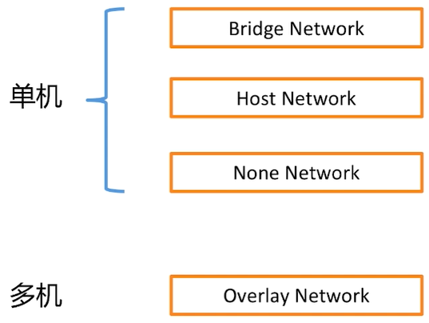 

# 环境搭建

- 使用vagrant搭建2个节点

```bash
# -*- mode: ruby -*-
# vi: set ft=ruby :

Vagrant.require_version ">= 1.6.0"

boxes = [
    {
        :name => "docker-node1",
        :eth1 => "192.168.205.10",
        :mem => "1024",
        :cpu => "1"
    },
    {
        :name => "docker-node2",
        :eth1 => "192.168.205.11",
        :mem => "1024",
        :cpu => "1"
    }
]

Vagrant.configure(2) do |config|

  config.vm.box = "centos/7"

  boxes.each do |opts|
      config.vm.define opts[:name] do |config|
        config.vm.hostname = opts[:name]
        config.vm.provider "vmware_fusion" do |v|
          v.vmx["memsize"] = opts[:mem]
          v.vmx["numvcpus"] = opts[:cpu]
        end

        config.vm.provider "virtualbox" do |v|
          v.customize ["modifyvm", :id, "--memory", opts[:mem]]
          v.customize ["modifyvm", :id, "--cpus", opts[:cpu]]
        end

        config.vm.network :private_network, ip: opts[:eth1]
      end
  end

  config.vm.synced_folder "./labs", "/home/vagrant/labs"
  config.vm.provision "shell", privileged: true, path: "./setup.sh"

end
```

- setup.sh

```bash
#/bin/sh

# install some tools
sudo yum install -y git vim gcc glibc-static telnet bridge-utils

# install docker
curl -fsSL get.docker.com -o get-docker.sh
sh get-docker.sh

# start docker service
sudo groupadd docker
sudo usermod -aG docker vagrant
sudo systemctl start docker

rm -rf get-docker.sh
```

- 启动

```bash
vagrant up
vagrant status
# 在win上 ping 这2台主机 192.168.205.10 192.168.205.11 可以ping通
# 内部相互可以ping通
```


## 进入第一台主机

```bash
vagrant ssh docker-node1
```


# 网络基本概念

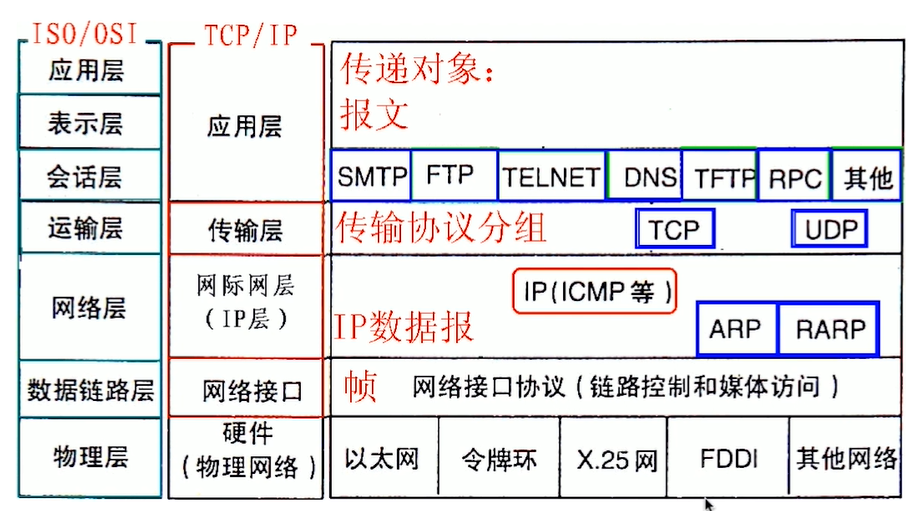 


## 公有ip和私有ip

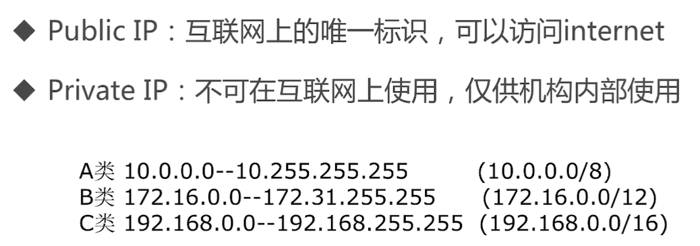 


## 网络地址转换

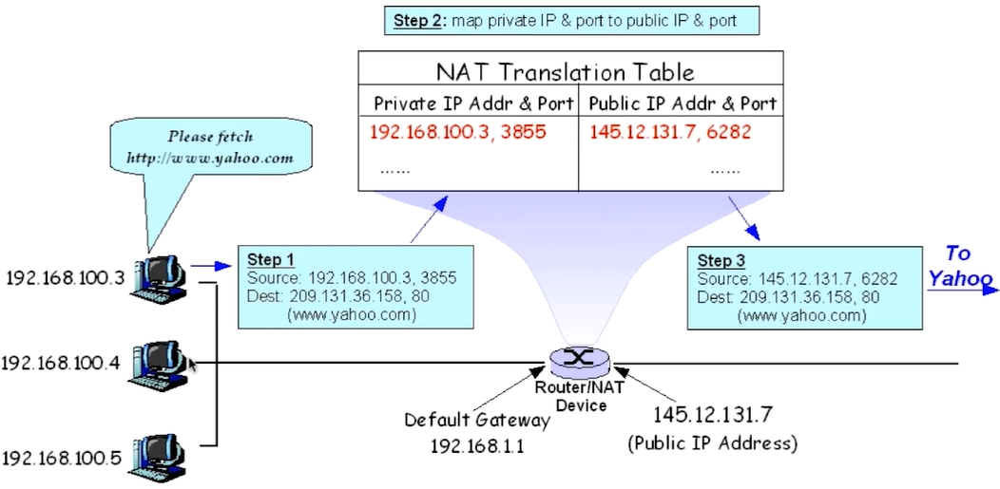 


# 网络命名空间


## docker 网络命名空间的通信

运行busybox

- linux 的image

```bash
[vagrant@docker-node1 labs]$ docker run -d --name test01 busybox /bin/sh -c "while true; do sleep 3600;done"

[vagrant@docker-node1 labs]$ docker ps
CONTAINER ID        IMAGE               COMMAND                  CREATED             STATUS              PORTS               NAMES
1581fb5bcf13        busybox             "/bin/sh -c 'while t…"   40 seconds ago      Up 40 seconds                           test01
# 进入到容器中
[vagrant@docker-node1 labs]$ docker exec -it 1581fb5bcf13 /bin/sh
# 使用ip a 查看端口
/ # ip a
1: lo: <LOOPBACK,UP,LOWER_UP> mtu 65536 qdisc noqueue qlen 1000
    link/loopback 00:00:00:00:00:00 brd 00:00:00:00:00:00
    inet 127.0.0.1/8 scope host lo
       valid_lft forever preferred_lft forever
5: eth0@if6: <BROADCAST,MULTICAST,UP,LOWER_UP,M-DOWN> mtu 1500 qdisc noqueue
    link/ether 02:42:ac:11:00:02 brd ff:ff:ff:ff:ff:ff
    inet 172.17.0.2/16 brd 172.17.255.255 scope global eth0
       valid_lft forever preferred_lft forever

```

- 在linux虚拟机中查看ip a
  - linux虚拟机有自己独立的ip，则有自己的网络的命名空间

```bash
[vagrant@docker-node1 labs]$ ip a
1: lo: <LOOPBACK,UP,LOWER_UP> mtu 65536 qdisc noqueue state UNKNOWN group default qlen 1000
    link/loopback 00:00:00:00:00:00 brd 00:00:00:00:00:00
    inet 127.0.0.1/8 scope host lo
       valid_lft forever preferred_lft forever
    inet6 ::1/128 scope host
       valid_lft forever preferred_lft forever
2: eth0: <BROADCAST,MULTICAST,UP,LOWER_UP> mtu 1500 qdisc pfifo_fast state UP group default qlen 1000
    link/ether 52:54:00:8a:fe:e6 brd ff:ff:ff:ff:ff:ff
    inet 10.0.2.15/24 brd 10.0.2.255 scope global noprefixroute dynamic eth0
       valid_lft 84509sec preferred_lft 84509sec
    inet6 fe80::5054:ff:fe8a:fee6/64 scope link
       valid_lft forever preferred_lft forever
3: eth1: <BROADCAST,MULTICAST,UP,LOWER_UP> mtu 1500 qdisc pfifo_fast state UP group default qlen 1000
    link/ether 08:00:27:80:b2:90 brd ff:ff:ff:ff:ff:ff
    inet 192.168.205.10/24 brd 192.168.205.255 scope global noprefixroute eth1
       valid_lft forever preferred_lft forever
    inet6 fe80::a00:27ff:fe80:b290/64 scope link
       valid_lft forever preferred_lft forever
4: docker0: <BROADCAST,MULTICAST,UP,LOWER_UP> mtu 1500 qdisc noqueue state UP group default
    link/ether 02:42:54:4b:00:07 brd ff:ff:ff:ff:ff:ff
    inet 172.17.0.1/16 brd 172.17.255.255 scope global docker0
       valid_lft forever preferred_lft forever
    inet6 fe80::42:54ff:fe4b:7/64 scope link
       valid_lft forever preferred_lft forever
6: vethb975913@if5: <BROADCAST,MULTICAST,UP,LOWER_UP> mtu 1500 qdisc noqueue master docker0 state UP group default
    link/ether 92:45:e6:a7:b7:dc brd ff:ff:ff:ff:ff:ff link-netnsid 0
    inet6 fe80::9045:e6ff:fea7:b7dc/64 scope link
       valid_lft forever preferred_lft forever
```

- 再运行一个busybox

```bash
[vagrant@docker-node1 labs]$ docker run -d --name test02 busybox /bin/sh -c "while true; do sleep 3600;done"
a18923baa737b37878be25445017b2c7fa9260c532c138b8eb14e079a5fca4d9
[vagrant@docker-node1 labs]$ docker ps
CONTAINER ID        IMAGE               COMMAND                  CREATED             STATUS              PORTS               NAMES
a18923baa737        busybox             "/bin/sh -c 'while t…"   4 seconds ago       Up 3 seconds                            test02
1581fb5bcf13        busybox             "/bin/sh -c 'while t…"   9 minutes ago       Up 9 minutes                            test01

# 分别查看各自的网络
[vagrant@docker-node1 labs]$ docker exec a18923baa737 ip a
1: lo: <LOOPBACK,UP,LOWER_UP> mtu 65536 qdisc noqueue qlen 1000
    link/loopback 00:00:00:00:00:00 brd 00:00:00:00:00:00
    inet 127.0.0.1/8 scope host lo
       valid_lft forever preferred_lft forever
7: eth0@if8: <BROADCAST,MULTICAST,UP,LOWER_UP,M-DOWN> mtu 1500 qdisc noqueue
    link/ether 02:42:ac:11:00:03 brd ff:ff:ff:ff:ff:ff
    inet 172.17.0.3/16 brd 172.17.255.255 scope global eth0 # 网络空间地址
       valid_lft forever preferred_lft forever
       
[vagrant@docker-node1 labs]$ docker exec 1581fb5bcf13 ip a
1: lo: <LOOPBACK,UP,LOWER_UP> mtu 65536 qdisc noqueue qlen 1000
    link/loopback 00:00:00:00:00:00 brd 00:00:00:00:00:00
    inet 127.0.0.1/8 scope host lo
       valid_lft forever preferred_lft forever
5: eth0@if6: <BROADCAST,MULTICAST,UP,LOWER_UP,M-DOWN> mtu 1500 qdisc noqueue
    link/ether 02:42:ac:11:00:02 brd ff:ff:ff:ff:ff:ff
    inet 172.17.0.2/16 brd 172.17.255.255 scope global eth0  # 网络空间地址
       valid_lft forever preferred_lft forever

# 容器的内部进行ping处理，可以ping通
[vagrant@docker-node1 labs]$ docker exec -it 1581fb5bcf13 /bin/sh
/ # ping 172.17.0.3
PING 172.17.0.3 (172.17.0.3): 56 data bytes
64 bytes from 172.17.0.3: seq=0 ttl=64 time=0.057 ms

```


## 查看网络命名空间

```bash
ip netns list
```


## 创建网络命名空间

```bash
[vagrant@docker-node1 labs]$ sudo ip netns add test1
[vagrant@docker-node1 labs]$ sudo ip netns list
test1
```


## 删除网络命名空间

```bash
ip netns delete xxx
```


## 查看网名命名空间的地址

```bash
[vagrant@docker-node1 labs]$ sudo ip netns exec test1 ip a
# 此时网络情况是DOWN
1: lo: <LOOPBACK> mtu 65536 qdisc noop state DOWN group default qlen 1000
    link/loopback 00:00:00:00:00:00 brd 00:00:00:00:00:00

# 查看虚拟机的网络链接情况
[vagrant@docker-node1 labs]$ ip link
1: lo: <LOOPBACK,UP,LOWER_UP> mtu 65536 qdisc noqueue state UNKNOWN mode DEFAULT group default qlen 1000
    link/loopback 00:00:00:00:00:00 brd 00:00:00:00:00:00
2: eth0: <BROADCAST,MULTICAST,UP,LOWER_UP> mtu 1500 qdisc pfifo_fast state UP mode DEFAULT group default qlen 1000
    link/ether 52:54:00:8a:fe:e6 brd ff:ff:ff:ff:ff:ff
3: eth1: <BROADCAST,MULTICAST,UP,LOWER_UP> mtu 1500 qdisc pfifo_fast state UP mode DEFAULT group default qlen 1000
    link/ether 08:00:27:80:b2:90 brd ff:ff:ff:ff:ff:ff
4: docker0: <BROADCAST,MULTICAST,UP,LOWER_UP> mtu 1500 qdisc noqueue state UP mode DEFAULT group default
    link/ether 02:42:54:4b:00:07 brd ff:ff:ff:ff:ff:ff
6: vethb975913@if5: <BROADCAST,MULTICAST,UP,LOWER_UP> mtu 1500 qdisc noqueue master docker0 state UP mode DEFAULT group default
    link/ether 92:45:e6:a7:b7:dc brd ff:ff:ff:ff:ff:ff link-netnsid 0
8: veth48ce25d@if7: <BROADCAST,MULTICAST,UP,LOWER_UP> mtu 1500 qdisc noqueue master docker0 state UP mode DEFAULT group default
    link/ether fa:f4:38:cc:71:7f brd ff:ff:ff:ff:ff:ff link-netnsid 1

[vagrant@docker-node1 labs]$ sudo ip netns exec test1 ip link
1: lo: <LOOPBACK> mtu 65536 qdisc noop state DOWN mode DEFAULT group default qlen 1000
    link/loopback 00:00:00:00:00:00 brd 00:00:00:00:00:00

# 将test1命名空间内的ip 设置为UP
[vagrant@docker-node1 labs]$ sudo ip netns exec test1 ip link set dev lo up
[vagrant@docker-node1 labs]$ sudo ip netns exec test1 ip link
# 由于需要2端建立链接，才能UP，一端准备好只能是UNKNOWN状态
1: lo: <LOOPBACK,UP,LOWER_UP> mtu 65536 qdisc noqueue state UNKNOWN mode DEFAULT group default qlen 1000
    link/loopback 00:00:00:00:00:00 brd 00:00:00:00:00:00

```


## 网络命名空间的互通

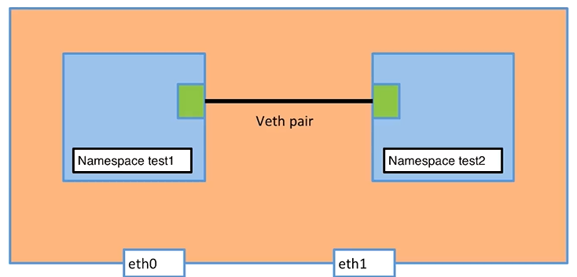 


### 模拟容器网络命名空间通信机制

- 创建veth pair
```bash
# 建立1个veth pair，2端分别是veth-test1和veth-test2
[vagrant@docker-node1 labs]$ sudo ip link add veth-test1 type veth peer name veth-test2

[vagrant@docker-node1 labs]$ ip link
1: lo: <LOOPBACK,UP,LOWER_UP> mtu 65536 qdisc noqueue state UNKNOWN mode DEFAULT group default qlen 1000
    link/loopback 00:00:00:00:00:00 brd 00:00:00:00:00:00
2: eth0: <BROADCAST,MULTICAST,UP,LOWER_UP> mtu 1500 qdisc pfifo_fast state UP mode DEFAULT group default qlen 1000
    link/ether 52:54:00:8a:fe:e6 brd ff:ff:ff:ff:ff:ff
...
9: veth-test2@veth-test1: <BROADCAST,MULTICAST,M-DOWN> mtu 1500 qdisc noop state DOWN mode DEFAULT group default qlen 1000
   # 只有mac地址，没有ip，状态是DOWN
   link/ether 46:8e:fe:72:cf:07 brd ff:ff:ff:ff:ff:ff
   # 注意：10中含有veth-test1
10: veth-test1@veth-test2: <BROADCAST,MULTICAST,M-DOWN> mtu 1500 qdisc noop state DOWN mode DEFAULT group default qlen 1000
    link/ether 0e:af:5b:06:58:61 brd ff:ff:ff:ff:ff:ff
```

- 给test1设置veth pair

```bash
# 将veth-test1 添加到test1中
# 添加前状态
[vagrant@docker-node1 labs]$ sudo ip netns exec test1 ip link
1: lo: <LOOPBACK,UP,LOWER_UP> mtu 65536 qdisc noqueue state UNKNOWN mode DEFAULT group default qlen 1000
    link/loopback 00:00:00:00:00:00 brd 00:00:00:00:00:00

# 给test1添加veth pair的一端
[vagrant@docker-node1 labs]$ sudo ip link set veth-test1 netns test1

# 添加后状态
[vagrant@docker-node1 labs]$ sudo ip netns exec test1 ip link
1: lo: <LOOPBACK,UP,LOWER_UP> mtu 65536 qdisc noqueue state UNKNOWN mode DEFAULT group default qlen 1000
    link/loopback 00:00:00:00:00:00 brd 00:00:00:00:00:00
    # 此时veth-test1已经绑定了
10: veth-test1@if9: <BROADCAST,MULTICAST> mtu 1500 qdisc noop state DOWN mode DEFAULT group default qlen 1000
    link/ether 0e:af:5b:06:58:61 brd ff:ff:ff:ff:ff:ff link-netnsid 0
    
# 查看虚拟机的ip link
[vagrant@docker-node1 labs]$ ip link
1: lo: <LOOPBACK,UP,LOWER_UP> mtu 65536 qdisc noqueue state UNKNOWN mode DEFAULT group default qlen 1000
...
# 只剩下了9 ，之前的10添加到test1中去了
9: veth-test2@if10: <BROADCAST,MULTICAST> mtu 1500 qdisc noop state DOWN mode DEFAULT group default qlen 1000
    link/ether 46:8e:fe:72:cf:07 brd ff:ff:ff:ff:ff:ff link-netnsid 2

```

- 给test2命名空间设置veth-test2

```bash
[vagrant@docker-node1 labs]$  sudo ip link set veth-test2 netns test2

[vagrant@docker-node1 labs]$ sudo ip netns exec test2 ip link
1: lo: <LOOPBACK> mtu 65536 qdisc noop state DOWN mode DEFAULT group default qlen 1000
    link/loopback 00:00:00:00:00:00 brd 00:00:00:00:00:00
       # 此时veth-test2已经绑定了
9: veth-test2@if10: <BROADCAST,MULTICAST> mtu 1500 qdisc noop state DOWN mode DEFAULT group default qlen 1000
    link/ether 46:8e:fe:72:cf:07 brd ff:ff:ff:ff:ff:ff link-netnsid 0
```

- 此时2个veth端状态都是DOWN的，而且没有ip，配置ip地址

```bash
[vagrant@docker-node1 labs]$ sudo ip netns exec test1 ip addr add 192.168.1.1/24 dev veth-test1
[vagrant@docker-node1 labs]$ sudo ip netns exec test2 ip addr add 192.168.1.2/24 dev veth-test2

# 启动veth
[vagrant@docker-node1 labs]$ sudo ip netns exec test1 ip link set dev veth-test1 up
[vagrant@docker-node1 labs]$ sudo ip netns exec test2 ip link set dev veth-test2 up

# 查看状态
[vagrant@docker-node1 labs]$ sudo ip netns exec test1 ip link
1: lo: <LOOPBACK,UP,LOWER_UP> mtu 65536 qdisc noqueue state UNKNOWN mode DEFAULT group default qlen 1000
    link/loopback 00:00:00:00:00:00 brd 00:00:00:00:00:00
10: veth-test1@if9: <BROADCAST,MULTICAST,UP,LOWER_UP> mtu 1500 qdisc noqueue state UP mode DEFAULT group default qlen 1000
    link/ether 0e:af:5b:06:58:61 brd ff:ff:ff:ff:ff:ff link-netnsid 1

# 查看ip
[vagrant@docker-node1 labs]$ sudo ip netns exec test1 ip a
...
10: veth-test1@if9: <BROADCAST,MULTICAST,UP,LOWER_UP> mtu 1500 qdisc noqueue state UP group default qlen 1000
    link/ether 0e:af:5b:06:58:61 brd ff:ff:ff:ff:ff:ff link-netnsid 1
    inet 192.168.1.1/24 scope global veth-test1
       valid_lft forever preferred_lft forever
    inet6 fe80::caf:5bff:fe06:5861/64 scope link
       valid_lft forever preferred_lft forever
       
[vagrant@docker-node1 labs]$ sudo ip netns exec test2 ip a
...
9: veth-test2@if10: <BROADCAST,MULTICAST,UP,LOWER_UP> mtu 1500 qdisc noqueue state UP group default qlen 1000
    link/ether 46:8e:fe:72:cf:07 brd ff:ff:ff:ff:ff:ff link-netnsid 0
    inet 192.168.1.2/24 scope global veth-test2
       valid_lft forever preferred_lft forever
    inet6 fe80::448e:feff:fe72:cf07/64 scope link
       valid_lft forever preferred_lft forever
```

- 测试，使用test1命名空间去ping test2命名空间的ip地址

```bash
[vagrant@docker-node1 labs]$ sudo ip netns exec test1 ping 192.168.1.2
PING 192.168.1.2 (192.168.1.2) 56(84) bytes of data.
64 bytes from 192.168.1.2: icmp_seq=1 ttl=64 time=0.035 ms
...
# 同理使用test2去ping test1也是一样的
```


# bridge0详解

- 在命名空间中，使用veth-pair模拟docker容器内部通信，但是docker容器内部可以ping通外部网络，说明docker并非使用veth-pair实现网络通信机制

实验

- 去除之前创建的busybox的test02容器

```bash
[vagrant@docker-node1 labs]$ docker ps
CONTAINER ID        IMAGE               COMMAND                  CREATED             STATUS              PORTS               NAMES
a18923baa737        busybox             "/bin/sh -c 'while t…"   58 minutes ago      Up 58 minutes                           test02
1581fb5bcf13        busybox             "/bin/sh -c 'while t…"   About an hour ago   Up About an hour                        test01
[vagrant@docker-node1 labs]$ docker stop test02
test02
[vagrant@docker-node1 labs]$ docker rm test02
test02
[vagrant@docker-node1 labs]$ docker ps
CONTAINER ID        IMAGE               COMMAND                  CREATED             STATUS              PORTS               NAMES
1581fb5bcf13        busybox             "/bin/sh -c 'while t…"   About an hour ago   Up About an hour                        test01
```


## 查看docker的网络 [docker network ls]

```bash
[vagrant@docker-node1 labs]$ docker network ls
NETWORK ID          NAME                DRIVER              SCOPE
9f11258ba697        bridge              bridge              local
73d7d392ba35        host                host                local
9563cfefb934        none                null                local
```

- 查看bridge

```bash
[vagrant@docker-node1 labs]$ docker network inspect 9f11258ba697 # bridge的network id
# 也可以输入 docker network inspect bridge
[
    {
        "Name": "bridge",
        "Id": "9f11258ba697edef5a1c71fdbe482e4da142609acfc1c3c5dbf150a4787a8db8",
        "Created": "2020-04-10T14:47:27.897140984Z",
        "Scope": "local",
        "Driver": "bridge",
        "EnableIPv6": false,
        "IPAM": {
            "Driver": "default",
            "Options": null,
            "Config": [
                {
                    "Subnet": "172.17.0.0/16"
                }
            ]
        },
        "Internal": false,
        "Attachable": false,
        "Ingress": false,
        "ConfigFrom": {
            "Network": ""
        },
        "ConfigOnly": false,
        "Containers": { 
         # 说明容器注册到该bridge上了
            "1581fb5bcf13e6622b4b287cf2a729cfe3f6a417a2600006f6862c80c4c8e03e": {
                "Name": "test01",
                "EndpointID": "a5a64ecb1fd3f601148f757f4d89d147dc9119785997f776267bcafde5257fb0",
                "MacAddress": "02:42:ac:11:00:02",
                "IPv4Address": "172.17.0.2/16",
                "IPv6Address": ""
            }
        },
        "Options": {
            "com.docker.network.bridge.default_bridge": "true",
            "com.docker.network.bridge.enable_icc": "true",
            "com.docker.network.bridge.enable_ip_masquerade": "true",
            "com.docker.network.bridge.host_binding_ipv4": "0.0.0.0",
            "com.docker.network.bridge.name": "docker0",
            "com.docker.network.driver.mtu": "1500"
        },
        "Labels": {}
    }
]
```

- 查看虚拟机ip a

```bash
[vagrant@docker-node1 labs]$ sudo ip a
...
# docker0是本机的network namespace，也是bridge
4: docker0: <BROADCAST,MULTICAST,UP,LOWER_UP> mtu 1500 qdisc noqueue state UP group default
    link/ether 02:42:54:4b:00:07 brd ff:ff:ff:ff:ff:ff
    inet 172.17.0.1/16 brd 172.17.255.255 scope global docker0
       valid_lft forever preferred_lft forever
    inet6 fe80::42:54ff:fe4b:7/64 scope link
       valid_lft forever preferred_lft forever
# vethb975913是本机的veth，用于连接docker0       
6: vethb975913@if5: <BROADCAST,MULTICAST,UP,LOWER_UP> mtu 1500 qdisc noqueue master docker0 state UP group default
    link/ether 92:45:e6:a7:b7:dc brd ff:ff:ff:ff:ff:ff link-netnsid 0
    inet6 fe80::9045:e6ff:fea7:b7dc/64 scope link
       valid_lft forever preferred_lft forever
```


## 安装brctl查看连接关系

```bash
sudo yum install bridge-utils
```

- 使用show查看关系

```bash
[vagrant@docker-node1 labs]$ brctl show
bridge name     bridge id               STP enabled     interfaces
docker0         8000.0242544b0007       no              vethb975913
```

- 启动busybox的另一个容器test02

```bash
[vagrant@docker-node1 labs]$ docker run -d --name=test02 busybox /bin/sh -c "while true; do sleep 3600;done"
[vagrant@docker-node1 labs]$ docker network inspect bridge
[
    {
        "Name": "bridge",
        "Id": "9f11258ba697edef5a1c71fdbe482e4da142609acfc1c3c5dbf150a4787a8db8",
        "Created": "2020-04-10T14:47:27.897140984Z",
        "Scope": "local",
        "Driver": "bridge",
        "EnableIPv6": false,
        "IPAM": {
            "Driver": "default",
            "Options": null,
            "Config": [
                {
                    "Subnet": "172.17.0.0/16"
                }
            ]
        },
        "Internal": false,
        "Attachable": false,
        "Ingress": false,
        "ConfigFrom": {
            "Network": ""
        },
        "ConfigOnly": false,
        "Containers": {
        # 可以看到启动了2个容器的连接
            "1581fb5bcf13e6622b4b287cf2a729cfe3f6a417a2600006f6862c80c4c8e03e": {
                "Name": "test01",
                "EndpointID": "a5a64ecb1fd3f601148f757f4d89d147dc9119785997f776267bcafde5257fb0",
                "MacAddress": "02:42:ac:11:00:02",
                "IPv4Address": "172.17.0.2/16",
                "IPv6Address": ""
            },
            "85279a84dd2c69db957f8f52ec7174d0416b6565fe6f6f315863a260b1f0a18d": {
                "Name": "test02",
                "EndpointID": "04fdd1163ce37d912b947e5f18aa9fa1b7a9d7f868d27d78d09c2263e1bf8b96",
                "MacAddress": "02:42:ac:11:00:03",
                "IPv4Address": "172.17.0.3/16",
                "IPv6Address": ""
            }
        },
        "Options": {
            "com.docker.network.bridge.default_bridge": "true",
            "com.docker.network.bridge.enable_icc": "true",
            "com.docker.network.bridge.enable_ip_masquerade": "true",
            "com.docker.network.bridge.host_binding_ipv4": "0.0.0.0",
            "com.docker.network.bridge.name": "docker0",
            "com.docker.network.driver.mtu": "1500"
        },
        "Labels": {}
    }
]
```

- 查看linux主机的ip a

```bash
[vagrant@docker-node1 labs]$ ip a
...
4: docker0: <BROADCAST,MULTICAST,UP,LOWER_UP> mtu 1500 qdisc noqueue state UP group default
    link/ether 02:42:54:4b:00:07 brd ff:ff:ff:ff:ff:ff
    inet 172.17.0.1/16 brd 172.17.255.255 scope global docker0
       valid_lft forever preferred_lft forever
    inet6 fe80::42:54ff:fe4b:7/64 scope link
       valid_lft forever preferred_lft forever
6: vethb975913@if5: <BROADCAST,MULTICAST,UP,LOWER_UP> mtu 1500 qdisc noqueue master docker0 state UP group default
    link/ether 92:45:e6:a7:b7:dc brd ff:ff:ff:ff:ff:ff link-netnsid 0
    inet6 fe80::9045:e6ff:fea7:b7dc/64 scope link
       valid_lft forever preferred_lft forever
# 当容器test02启动时，又多出一个veth连接docker0       
12: veth6741c54@if11: <BROADCAST,MULTICAST,UP,LOWER_UP> mtu 1500 qdisc noqueue master docker0 state UP group default
    link/ether 72:39:ff:70:51:0e brd ff:ff:ff:ff:ff:ff link-netnsid 1
    inet6 fe80::7039:ffff:fe70:510e/64 scope link
       valid_lft forever preferred_lft forever
```

- 再查看docker0的连接关系

```bash
[vagrant@docker-node1 labs]$ brctl show
bridge name     bridge id               STP enabled     interfaces
docker0         8000.0242544b0007       no              veth6741c54 # 与test02关联的linux主机的veth
                                                        vethb975913 # 与test01关联的linux主机的veth
```

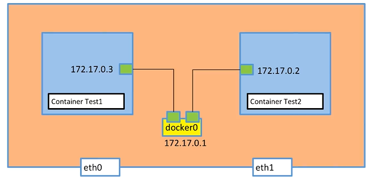 


## 容器与外网连接

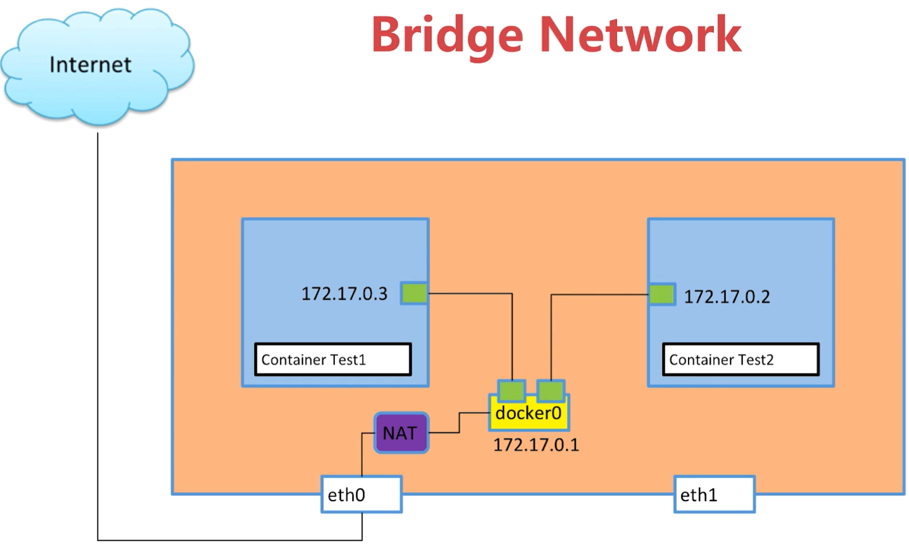 


# 容器之间的link（自定义bridge连接）

- 通过容器的名称访问该容器的连接

```bash
# 删除原先的test02容器，新建一个test02，含有容器的连接名称
docker run -d --name test02 --link test01 busybox /bin/sh -c "while true;do sleep 3600;done"
```

- 进入test02，进行ping测试，可以ping通，反之，从test01 ping test02是不行的
  - 等于做了一个dns映射，将test01和他的ip进行关联，直接访问名称可以调用
  - 应用：如mysql服务，指定mysql容器的名称，那么使用mysql:3306可以访问

```bash
[vagrant@docker-node1 labs]$ docker exec -it test02 /bin/sh
/ # ping test01
PING test01 (172.17.0.2): 56 data bytes
64 bytes from 172.17.0.2: seq=0 ttl=64 time=0.070 ms
...
```


## 新建bridge连接

- 新建一个bridge

```bash
[vagrant@docker-node1 labs]$ docker network create --driver bridge my-bridge

# 查看网络
[vagrant@docker-node1 labs]$ docker network ls
NETWORK ID          NAME                DRIVER              SCOPE
9f11258ba697        bridge              bridge              local
73d7d392ba35        host                host                local
# 新建的bridge
6632446b583f        my-bridge           bridge              local
9563cfefb934        none                null                local

[vagrant@docker-node1 labs]$ brctl show
bridge name     bridge id               STP enabled     interfaces
br-6632446b583f         8000.024268a2ceff       no # 新建的bridge
docker0         8000.0242544b0007       no              veth1adfe5a
                                                        vethb975913
```


## 新建容器连接到自定义bridge

- 新建一个容器，连接到新建的bridge上

```bash
$ docker run -d --name=test03 --network=my-bridge busybox /bin/sh -c "while true;do sleep 3600;done"
$ brctl show
bridge name     bridge id               STP enabled     interfaces
br-6632446b583f         8000.024268a2ceff       no       vethbd66644 # 连接上了
...
```

- 查看连接详细

```bash
$ docker network inspect my-bridge
[
    {
        "Name": "my-bridge",
        "Id": "6632446b583f71fbc6fef60c3b331484d79fc78d75f528210722d8299772016f",
        "Created": "2020-04-11T06:39:24.799349069Z",
        "Scope": "local",
        "Driver": "bridge",
        "EnableIPv6": false,
        "IPAM": {
            "Driver": "default",
            "Options": {},
            "Config": [
                {
                    "Subnet": "172.18.0.0/16",
                    "Gateway": "172.18.0.1"
                }
            ]
        },
        "Internal": false,
        "Attachable": false,
        "Ingress": false,
        "ConfigFrom": {
            "Network": ""
        },
        "ConfigOnly": false,
        "Containers": {
            "84c13a8cb1724d09350098271f44d39f4d51505312a29d35f9f45bb4dd4c466c": {
                "Name": "test03",
                "EndpointID": "0eb66cbec3240bfa787637ec6c7a3e6275fd40a31bf967abc7fb7c7d91fe03fc",
                "MacAddress": "02:42:ac:12:00:02",
                "IPv4Address": "172.18.0.2/16",
                "IPv6Address": ""
            }
        },
        "Options": {},
        "Labels": {}
    }
]
```


## 自定义bridge连接其他容器

- 自定义bridge与docker默认bridge(name：bridge，veth：docker0)的区别在于
  - 自定义bridge有容器名称和ip关系的联系，而不用自己维护映射关系，去link容器
  - 而默认的则没有

```bash
$ docker network connect my-bridge test02

# 进入test02容器内ping test03 可以ping通
$ docker exec -it test02 /bin/sh
/ # ping test03
PING test03 (172.18.0.2): 56 data bytes
# 此时ping的ip地址是172.18...
64 bytes from 172.18.0.2: seq=0 ttl=64 time=0.049 ms
...
```

- 通过自定义bridge连接容器后，可以直接使用容器名称进行连接
- 说明自定义bridge包含了容器和ip的映射

```bash
$ docker exec -it test02 /bin/sh
/ # ip a
1: lo: <LOOPBACK,UP,LOWER_UP> mtu 65536 qdisc noqueue qlen 1000
    link/loopback 00:00:00:00:00:00 brd 00:00:00:00:00:00
    inet 127.0.0.1/8 scope host lo
       valid_lft forever preferred_lft forever
      # 该veth是连接docker0的
13: eth0@if14: <BROADCAST,MULTICAST,UP,LOWER_UP,M-DOWN> mtu 1500 qdisc noqueue
    link/ether 02:42:ac:11:00:03 brd ff:ff:ff:ff:ff:ff
    inet 172.17.0.3/16 brd 172.17.255.255 scope global eth0
       valid_lft forever preferred_lft forever
     # 该veth是连接my-bridge的，注意ip
18: eth1@if19: <BROADCAST,MULTICAST,UP,LOWER_UP,M-DOWN> mtu 1500 qdisc noqueue
    link/ether 02:42:ac:12:00:03 brd ff:ff:ff:ff:ff:ff
    # ip地址的变化是172.18...
    inet 172.18.0.3/16 brd 172.18.255.255 scope global eth1
       valid_lft forever preferred_lft forever
```

- 查看网络连接情况

```bash
$ sudo docker network connect my-bridge test01
$ brctl show
bridge name     bridge id               STP enabled     interfaces
br-6632446b583f         8000.024268a2ceff       no      veth124ecf9
                                                        veth2285d53
                                                        vethbd66644
```


# 容器端口的映射（给外部访问）

- 建立的服务给外部访问

```bash
# 开启一个nginx服务，但是没有办法访问
$ docker run --name web -d nginx
# nginx默认是连接到bridge上
[vagrant@docker-node1 labs]$ docker network inspect bridge
[
    {
        "Name": "bridge",
        "Id": "9f11258ba697edef5a1c71fdbe482e4da142609acfc1c3c5dbf150a4787a8db8",
        "Created": "2020-04-10T14:47:27.897140984Z",
        "Scope": "local",
        "Driver": "bridge",
        "EnableIPv6": false,
        "IPAM": {
            "Driver": "default",
            "Options": null,
            "Config": [
                {
                    "Subnet": "172.17.0.0/16"
                }
            ]
        },
        "Internal": false,
        "Attachable": false,
        "Ingress": false,
        "ConfigFrom": {
            "Network": ""
        },
        "ConfigOnly": false,
        "Containers": {
            "1dcc102563c9b7b2b497ebb04f6b626b57337ef2021d7771d67ce14c6880a1d9": {
                "Name": "web",
                "EndpointID": "f88b78934cd92d461b0a7dc83b0640c0f5b5474288da4646069c7904aad8d6d5",
                "MacAddress": "02:42:ac:11:00:04",
                "IPv4Address": "172.17.0.4/16",
                "IPv6Address": ""
            },
     ...
    }
]

$ ip a
...
4: docker0: <BROADCAST,MULTICAST,UP,LOWER_UP> mtu 1500 qdisc noqueue state UP group default
    link/ether 02:42:54:4b:00:07 brd ff:ff:ff:ff:ff:ff
    # 得到当前bridge的范围
    inet 172.17.0.1/16 brd 172.17.255.255 scope global docker0
       valid_lft forever preferred_lft forever
    inet6 fe80::42:54ff:fe4b:7/64 scope link
       valid_lft forever preferred_lft forever

# ping 该 172.17.0.4 ip 可以ping通，说明虚拟机可以访问，但是外网不能访问
```

- 配置外部可访问
  - 使用-p ，表示一个portmap

```bash
$ docker run -d -p 80:80 --name web nginx
$ docker ps
CONTAINER ID        IMAGE               COMMAND                  CREATED             STATUS              PORTS                NAMES
e5d1e31ce551        nginx               "nginx -g 'daemon of…"   41 seconds ago      Up 40 seconds       0.0.0.0:80->80/tcp   web

# 此时访问本地连接的端口，可以得到相应的返回，说明将容器内部的端口映射到了虚拟机上的端口
$ curl localhost
<!DOCTYPE html>
<html>
...
```

- 此时访问url：http://192.168.205.10/ 可得到结果

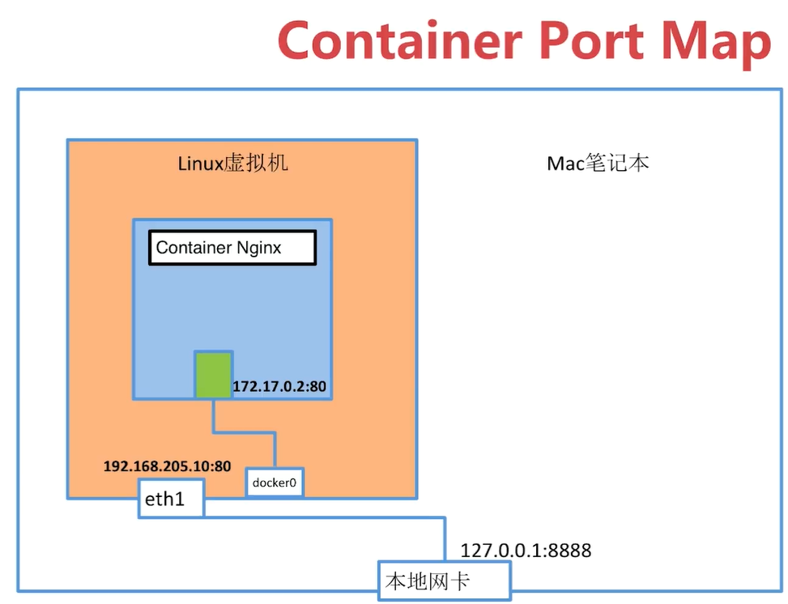  


# host & none 详解

```bash
[vagrant@docker-node1 labs]$ docker network ls
NETWORK ID          NAME                DRIVER              SCOPE
9f11258ba697        bridge              bridge              local
73d7d392ba35        host                host                local
6632446b583f        my-bridge           bridge              local
9563cfefb934        none                null                local
```

- 创建一个容器，连接到none

```bash
$ docker run -d --name test04 --network none busybox /bin/sh -c "while true; do sleep 3600;done"
```


## none

- 查看none的情况

```bash
$ docker network inspect none
[
    {
        "Name": "none",
        "Id": "9563cfefb934ccc6b68e0a8df6664f2a28da34be2dcbadbd866e981edde5d01a",
        "Created": "2020-04-10T14:47:27.875174059Z",
        "Scope": "local",
        "Driver": "null",
        "EnableIPv6": false,
        "IPAM": {
            "Driver": "default",
            "Options": null,
            "Config": []
        },
        "Internal": false,
        "Attachable": false,
        "Ingress": false,
        "ConfigFrom": {
            "Network": ""
        },
        "ConfigOnly": false,
        "Containers": {
            "f342c5fd3dbae82fdf0383fe02e4a3bb8353c5b047040d5857b9927a2d477e00": {
                "Name": "test04",
                "EndpointID": "fa27ae1e298f2c185197f78aecb05212639d89aa42a4fba04b08f13f9195e1a7",
                "MacAddress": "", # 注意 ip和mac为空
                "IPv4Address": "",
                "IPv6Address": ""
            }
        },
        "Options": {},
        "Labels": {}
    }
]
```

- 查看容器内部情况
  - 该容器是孤立的，只能通过exec访问

```sh
$ docker exec -it test04 /bin/sh
/ # ip a
1: lo: <LOOPBACK,UP,LOWER_UP> mtu 65536 qdisc noqueue qlen 1000
    link/loopback 00:00:00:00:00:00 brd 00:00:00:00:00:00
    inet 127.0.0.1/8 scope host lo
       valid_lft forever preferred_lft forever
```

- 应用场景
  - 安全性高的场景，存储在本地，在本地起一个容器
  - 很少使用


## host

```bash
$ docker run -d --name test05 --network host busybox /bin/sh -c "while true;do sleep 3600;done"

$ docker network inspect host
[
    {
        "Name": "host",
        "Id": "73d7d392ba35cd322118b2c338cb4bfacf86ad0459c65511e0261313d7cbd003",
        "Created": "2020-04-10T14:47:27.881890859Z",
        "Scope": "local",
        "Driver": "host",
        "EnableIPv6": false,
        "IPAM": {
            "Driver": "default",
            "Options": null,
            "Config": []
        },
        "Internal": false,
        "Attachable": false,
        "Ingress": false,
        "ConfigFrom": {
            "Network": ""
        },
        "ConfigOnly": false,
        "Containers": {
            "43354c7240e266ff37ee89a78a4e30818c454916de8656c3abc8e440ce9a7a5b": {
                "Name": "test05",
                "EndpointID": "1b04c9136d5a722552a5cf6e7a0cad1f9539720758734e4ff4054b58458d7102",
                "MacAddress": "", # 也没有显示ip和mac
                "IPv4Address": "",
                "IPv6Address": ""
            }
        },
        "Options": {},
        "Labels": {}
    }
]

# 通过exec访问
$ docker exec -it test05 /bin/sh
/ # ip a
...
# 查看虚拟机的ip a ，发现和容器的一致
```

- 容器使用host作为network，该容器和虚拟机共用同一个network namespace
  - 缺点：当一个容器使用了80端口时，另一个容器就不能使用了


# 多容器复杂部署

- app.py
  - 连接redis
  - 每次访问/时，redis中hits递增

```python
from flask import Flask
from redis import Redis
import os
import socket

app = Flask(__name__)
redis = Redis(host=os.environ.get('REDIS_HOST', '127.0.0.1'), port=6379)


@app.route('/')
def hello():
    redis.incr('hits')
    return 'Hello Container World! I have been seen %s times and my hostname is %s.\n' % (redis.get('hits'),socket.gethostname())

if __name__ == "__main__":
    app.run(host="0.0.0.0", port=5000, debug=True)
```

- Dockerfile

```sh
FROM python:2.7
LABEL maintaner="stt"
COPY . /app
WORKDIR /app
RUN pip install flask redis # 安装 flask 和 redis 库
EXPOSE 5000 # 对外暴露5000端口
CMD [ "python", "app.py" ]
```

- 安装redis的镜像
  - 注意redis没有使用-p参数对外部设置连接的端口，redis是给虚拟机内部容器调用的

```sh
$ docker run -d --name redis redis
$ docker ps
CONTAINER ID        IMAGE               COMMAND                  CREATED              STATUS              PORTS               NAMES
846be11b2740        redis               "docker-entrypoint.s…"   About a minute ago   Up About a minute   6379/tcp            redis
```

- 构建镜像

```bash
[vagrant@docker-node1 flask-redis]$ ll
total 9
-rwxrwxrwx. 1 vagrant vagrant  432 Nov 26 20:58 app.py
-rwxrwxrwx. 1 vagrant vagrant  154 Nov 26 20:58 Dockerfile
-rwxrwxrwx. 1 vagrant vagrant 5703 Nov 26 20:58 multi-host-network.md
[vagrant@docker-node1 flask-redis]$ docker build -t stt/flask-redis .
```

- 启动app应用
  - ==使用-e传递环境变量==

```bash
$ docker run -d --link redis --name flask-redis -e REDIS_HOST=redis stt/flask-redis
```

- 启动成功后使用exec进入容器

```bash
[vagrant@docker-node1 flask-redis]$ docker exec -it 8366b63f3bc5 /bin/bash
# 查看环境变量，给app.py中调用
root@8366b63f3bc5:/app# env
...
REDIS_HOST=redis
...
# 测试容器内访问
root@8366b63f3bc5:/app# curl localhost:5000
Hello Container World! I have been seen 1 times and my hostname is 8366b63f3bc5.
root@8366b63f3bc5:/app# curl localhost:5000
Hello Container World! I have been seen 2 times and my hostname is 8366b63f3bc5.
```

- 注意：上述方式只能容器内访问，如果要在容器外部访问需要暴露接口

```bash
$  docker run -d --link redis --name flask-redis -p 5000:5000 -e REDIS_HOST=redis stt/flask-redis
# 本地可以访问
$ curl localhost:5000
Hello Container World! I have been seen 4 times and my hostname is 8172fac245fd.
```

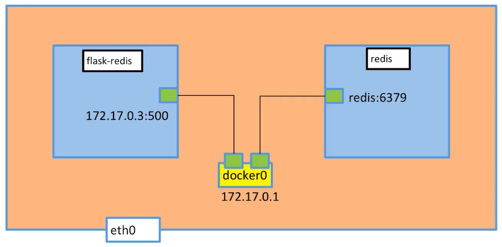 


# 多机器通信

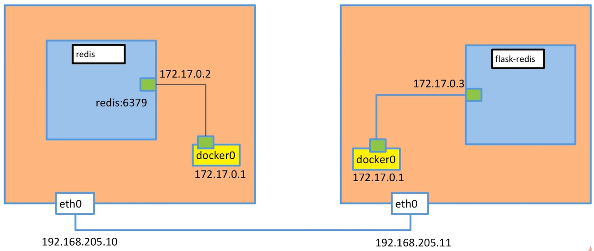 

- 通过wxlan的机制通信，将容器内通信的端与目的ip封装在http协议中，在应用层上传递
  - www.evoila.de
  - 具体的包结构
    - 在UDP以下的是underlay
    - 在UDP以上的是overlay，docker通信是在overlay的基础上的

  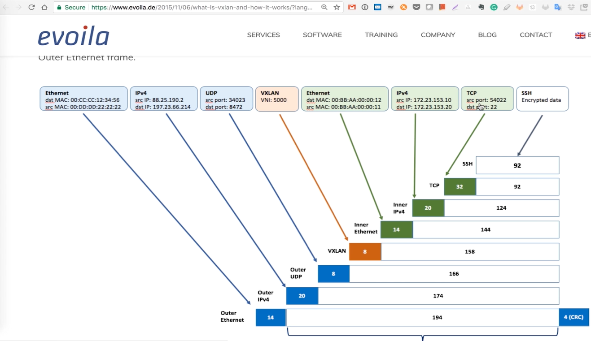


## 使用etcd实现

- 使用etcd获取对应服务的ip信息和容器信息，进行连接通信

### setup etcd cluster

- 在2台虚拟机上安装

```bash
vagrant ssh docker-node1
vagrant@docker-node1:~$ sudo yum -y install wget
```

在docker-node1上

```sh
vagrant@docker-node1:~$ wget https://github.com/coreos/etcd/releases/download/v3.0.12/etcd-v3.0.12-linux-amd64.tar.gz
vagrant@docker-node1:~$ tar zxvf etcd-v3.0.12-linux-amd64.tar.gz
vagrant@docker-node1:~$ cd etcd-v3.0.12-linux-amd64
vagrant@docker-node1:~$ nohup ./etcd --name docker-node1 --initial-advertise-peer-urls http://192.168.205.10:2380 \
--listen-peer-urls http://192.168.205.10:2380 \
--listen-client-urls http://192.168.205.10:2379,http://127.0.0.1:2379 \
--advertise-client-urls http://192.168.205.10:2379 \
--initial-cluster-token etcd-cluster \
--initial-cluster docker-node1=http://192.168.205.10:2380,docker-node2=http://192.168.205.11:2380 \
--initial-cluster-state new&
```


在docker-node2上

```sh
vagrant@docker-node2:~$ wget https://github.com/coreos/etcd/releases/download/v3.0.12/etcd-v3.0.12-linux-amd64.tar.gz
vagrant@docker-node2:~$ tar zxvf etcd-v3.0.12-linux-amd64.tar.gz
vagrant@docker-node2:~$ cd etcd-v3.0.12-linux-amd64/
vagrant@docker-node2:~$ nohup ./etcd --name docker-node2 --initial-advertise-peer-urls http://192.168.205.11:2380 \
--listen-peer-urls http://192.168.205.11:2380 \
--listen-client-urls http://192.168.205.11:2379,http://127.0.0.1:2379 \
--advertise-client-urls http://192.168.205.11:2379 \
--initial-cluster-token etcd-cluster \
--initial-cluster docker-node1=http://192.168.205.10:2380,docker-node2=http://192.168.205.11:2380 \
--initial-cluster-state new&
```

检查cluster状态

```sh
vagrant@docker-node2:~/etcd-v3.0.12-linux-amd64$ ./etcdctl cluster-health
member 21eca106efe4caee is healthy: got healthy result from http://192.168.205.10:2379
member 8614974c83d1cc6d is healthy: got healthy result from http://192.168.205.11:2379
cluster is healthy
```


## 重启docker服务


在docker-node1上

```sh
$ sudo service docker stop
$ sudo /usr/bin/dockerd -H tcp://0.0.0.0:2375 -H unix:///var/run/docker.sock --cluster-store=etcd://192.168.205.10:2379 --cluster-advertise=192.168.205.10:2375&
```

在docker-node2上

```sh
$ sudo service docker stop
$ sudo /usr/bin/dockerd -H tcp://0.0.0.0:2375 -H unix:///var/run/docker.sock --cluster-store=etcd://192.168.205.11:2379 --cluster-advertise=192.168.205.11:2375&
```


## 创建overlay network

在docker-node1上创建一个demo的overlay network

```sh
vagrant@docker-node1:~$ sudo docker network ls
NETWORK ID          NAME                DRIVER              SCOPE
0e7bef3f143a        bridge              bridge              local
a5c7daf62325        host                host                local
3198cae88ab4        none                null                local
vagrant@docker-node1:~$ sudo docker network create -d overlay demo
3d430f3338a2c3496e9edeccc880f0a7affa06522b4249497ef6c4cd6571eaa9
vagrant@docker-node1:~$ sudo docker network ls
NETWORK ID          NAME                DRIVER              SCOPE
0e7bef3f143a        bridge              bridge              local
3d430f3338a2        demo                overlay             global
a5c7daf62325        host                host                local
3198cae88ab4        none                null                local
vagrant@docker-node1:~$ sudo docker network inspect demo
[
    {
        "Name": "demo",
        "Id": "3d430f3338a2c3496e9edeccc880f0a7affa06522b4249497ef6c4cd6571eaa9",
        "Scope": "global",
        "Driver": "overlay",
        "EnableIPv6": false,
        "IPAM": {
            "Driver": "default",
            "Options": {},
            "Config": [
                {
                    "Subnet": "10.0.0.0/24",
                    "Gateway": "10.0.0.1/24"
                }
            ]
        },
        "Internal": false,
        "Containers": {},
        "Options": {},
        "Labels": {}
    }
]
```

我们会看到在node2上，这个demo的overlay network会被同步创建

```sh
vagrant@docker-node2:~$ sudo docker network ls
NETWORK ID          NAME                DRIVER              SCOPE
c9947d4c3669        bridge              bridge              local
3d430f3338a2        demo                overlay             global
fa5168034de1        host                host                local
c2ca34abec2a        none                null                local
```

通过查看etcd的key-value, 我们获取到，这个demo的network是通过etcd从node1同步到node2的

```sh
vagrant@docker-node2:~/etcd-v3.0.12-linux-amd64$ ./etcdctl ls /docker
/docker/network
/docker/nodes
vagrant@docker-node2:~/etcd-v3.0.12-linux-amd64$ ./etcdctl ls /docker/nodes
/docker/nodes/192.168.205.11:2375
/docker/nodes/192.168.205.10:2375
vagrant@docker-node2:~/etcd-v3.0.12-linux-amd64$ ./etcdctl ls /docker/network/v1.0/network
/docker/network/v1.0/network/3d430f3338a2c3496e9edeccc880f0a7affa06522b4249497ef6c4cd6571eaa9
vagrant@docker-node2:~/etcd-v3.0.12-linux-amd64$ ./etcdctl get /docker/network/v1.0/network/3d430f3338a2c3496e9edeccc880f0a7affa06522b4249497ef6c4cd6571eaa9 | jq .
{
  "addrSpace": "GlobalDefault",
  "enableIPv6": false,
  "generic": {
    "com.docker.network.enable_ipv6": false,
    "com.docker.network.generic": {}
  },
  "id": "3d430f3338a2c3496e9edeccc880f0a7affa06522b4249497ef6c4cd6571eaa9",
  "inDelete": false,
  "ingress": false,
  "internal": false,
  "ipamOptions": {},
  "ipamType": "default",
  "ipamV4Config": "[{\"PreferredPool\":\"\",\"SubPool\":\"\",\"Gateway\":\"\",\"AuxAddresses\":null}]",
  "ipamV4Info": "[{\"IPAMData\":\"{\\\"AddressSpace\\\":\\\"GlobalDefault\\\",\\\"Gateway\\\":\\\"10.0.0.1/24\\\",\\\"Pool\\\":\\\"10.0.0.0/24\\\"}\",\"PoolID\":\"GlobalDefault/10.0.0.0/24\"}]",
  "labels": {},
  "name": "demo",
  "networkType": "overlay",
  "persist": true,
  "postIPv6": false,
  "scope": "global"
}
```


## 创建连接demo网络的容器

在docker-node1上

```sh
vagrant@docker-node1:~$ sudo docker run -d --name test1 --net demo busybox sh -c "while true; do sleep 3600; done"
Unable to find image 'busybox:latest' locally
latest: Pulling from library/busybox
56bec22e3559: Pull complete
Digest: sha256:29f5d56d12684887bdfa50dcd29fc31eea4aaf4ad3bec43daf19026a7ce69912
Status: Downloaded newer image for busybox:latest
a95a9466331dd9305f9f3c30e7330b5a41aae64afda78f038fc9e04900fcac54
vagrant@docker-node1:~$ sudo docker ps
CONTAINER ID        IMAGE               COMMAND                  CREATED             STATUS              PORTS               NAMES
a95a9466331d        busybox             "sh -c 'while true; d"   4 seconds ago       Up 3 seconds                            test1
vagrant@docker-node1:~$ sudo docker exec test1 ifconfig
eth0      Link encap:Ethernet  HWaddr 02:42:0A:00:00:02
          inet addr:10.0.0.2  Bcast:0.0.0.0  Mask:255.255.255.0 # 地址1
          inet6 addr: fe80::42:aff:fe00:2/64 Scope:Link
          UP BROADCAST RUNNING MULTICAST  MTU:1450  Metric:1
          RX packets:15 errors:0 dropped:0 overruns:0 frame:0
          TX packets:8 errors:0 dropped:0 overruns:0 carrier:0
          collisions:0 txqueuelen:0
          RX bytes:1206 (1.1 KiB)  TX bytes:648 (648.0 B)

eth1      Link encap:Ethernet  HWaddr 02:42:AC:12:00:02
          inet addr:172.18.0.2  Bcast:0.0.0.0  Mask:255.255.0.0 # 地址2
          inet6 addr: fe80::42:acff:fe12:2/64 Scope:Link
          UP BROADCAST RUNNING MULTICAST  MTU:1500  Metric:1
          RX packets:8 errors:0 dropped:0 overruns:0 frame:0
          TX packets:8 errors:0 dropped:0 overruns:0 carrier:0
          collisions:0 txqueuelen:0
          RX bytes:648 (648.0 B)  TX bytes:648 (648.0 B)

lo        Link encap:Local Loopback
          inet addr:127.0.0.1  Mask:255.0.0.0
          inet6 addr: ::1/128 Scope:Host
          UP LOOPBACK RUNNING  MTU:65536  Metric:1
          RX packets:0 errors:0 dropped:0 overruns:0 frame:0
          TX packets:0 errors:0 dropped:0 overruns:0 carrier:0
          collisions:0 txqueuelen:1
          RX bytes:0 (0.0 B)  TX bytes:0 (0.0 B)

vagrant@docker-node1:~$
```


在docker-node2上

```sh
vagrant@docker-node2:~$ sudo docker run -d --name test1 --net demo busybox sh -c "while true; do sleep 3600; done"
Unable to find image 'busybox:latest' locally
latest: Pulling from library/busybox
56bec22e3559: Pull complete
Digest: sha256:29f5d56d12684887bdfa50dcd29fc31eea4aaf4ad3bec43daf19026a7ce69912
Status: Downloaded newer image for busybox:latest
fad6dc6538a85d3dcc958e8ed7b1ec3810feee3e454c1d3f4e53ba25429b290b
docker: Error response from daemon: service endpoint with name test1 already exists.
vagrant@docker-node2:~$ sudo docker run -d --name test2 --net demo busybox sh -c "while true; do sleep 3600; done"
9d494a2f66a69e6b861961d0c6af2446265bec9b1d273d7e70d0e46eb2e98d20
```


验证连通性。

```sh
vagrant@docker-node2:~$ sudo docker exec -it test2 ifconfig
eth0      Link encap:Ethernet  HWaddr 02:42:0A:00:00:03
          inet addr:10.0.0.3  Bcast:0.0.0.0  Mask:255.255.255.0 # 地址1
          inet6 addr: fe80::42:aff:fe00:3/64 Scope:Link
          UP BROADCAST RUNNING MULTICAST  MTU:1450  Metric:1
          RX packets:208 errors:0 dropped:0 overruns:0 frame:0
          TX packets:201 errors:0 dropped:0 overruns:0 carrier:0
          collisions:0 txqueuelen:0
          RX bytes:20008 (19.5 KiB)  TX bytes:19450 (18.9 KiB)

eth1      Link encap:Ethernet  HWaddr 02:42:AC:12:00:02
          inet addr:172.18.0.2  Bcast:0.0.0.0  Mask:255.255.0.0 # 地址2 连接的是docker_bridge中
          inet6 addr: fe80::42:acff:fe12:2/64 Scope:Link
          UP BROADCAST RUNNING MULTICAST  MTU:1500  Metric:1
          RX packets:8 errors:0 dropped:0 overruns:0 frame:0
          TX packets:8 errors:0 dropped:0 overruns:0 carrier:0
          collisions:0 txqueuelen:0
          RX bytes:648 (648.0 B)  TX bytes:648 (648.0 B)

lo        Link encap:Local Loopback
          inet addr:127.0.0.1  Mask:255.0.0.0
          inet6 addr: ::1/128 Scope:Host
          UP LOOPBACK RUNNING  MTU:65536  Metric:1
          RX packets:0 errors:0 dropped:0 overruns:0 frame:0
          TX packets:0 errors:0 dropped:0 overruns:0 carrier:0
          collisions:0 txqueuelen:1
          RX bytes:0 (0.0 B)  TX bytes:0 (0.0 B)

  vagrant@docker-node1:~$ sudo docker exec test1 sh -c "ping 10.0.0.3"
  PING 10.0.0.3 (10.0.0.3): 56 data bytes
  64 bytes from 10.0.0.3: seq=0 ttl=64 time=0.579 ms
  64 bytes from 10.0.0.3: seq=1 ttl=64 time=0.411 ms
  64 bytes from 10.0.0.3: seq=2 ttl=64 time=0.483 ms
```

- 原理：有2个网桥
  - ovnet负责与overlay进行通信
  - docker_gwbridge 负责对外通信的
  - 参考 https://github.com/docker/labs/blob/master/networking/concepts/06-overlay-networks.md

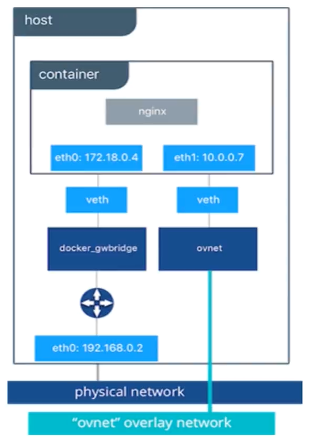 


## 数据传输过程

