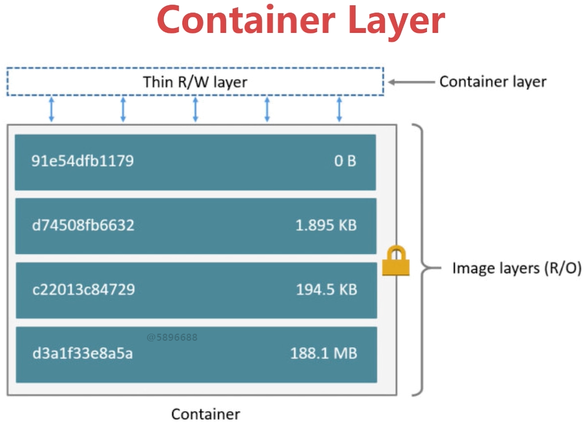
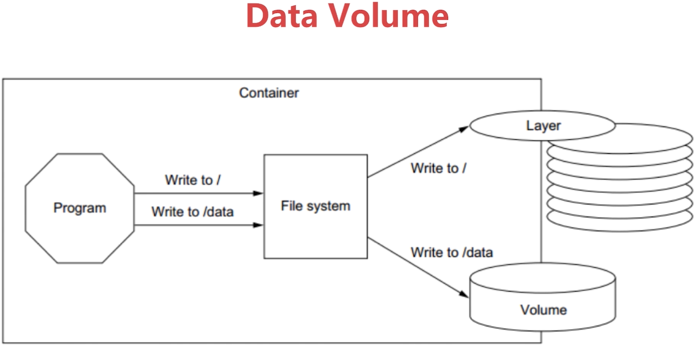
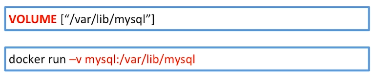

# 介绍

  

  


# docker 持久化数据的方案

- 基于本地系统的volume
  - 在执行docker create 或 docker run 时，通过-v参数将主机的目录作为容器的数据卷
- 基于plugin的volume
  - 支持第三方的存储方案，如NAS，aws
- Volume的类型
  - 受管理的data volume，由docker后台自动创建
  - 绑定挂载的volume，具体挂载位置可以由用户指定


# 实验的vagrant

```bash
# -*- mode: ruby -*-
# vi: set ft=ruby :

Vagrant.require_version ">= 1.6.0"

boxes = [
    {
        :name => "docker-host",
        :eth1 => "192.168.205.10",
        :mem => "1024",
        :cpu => "1"
    }
]

Vagrant.configure(2) do |config|

  config.vm.box = "centos/7"
  boxes.each do |opts|
    config.vm.define opts[:name] do |config|
      config.vm.hostname = opts[:name]
      config.vm.provider "vmware_fusion" do |v|
        v.vmx["memsize"] = opts[:mem]
        v.vmx["numvcpus"] = opts[:cpu]
      end
      config.vm.provider "virtualbox" do |v|
        v.customize ["modifyvm", :id, "--memory", opts[:mem]]
        v.customize ["modifyvm", :id, "--cpus", opts[:cpu]]
      end
      config.vm.network :private_network, ip: opts[:eth1]
    end
  end
  config.vm.synced_folder "./labs", "/home/vagrant/labs" # 设置虚拟机和docker文件夹的同步
  config.vm.provision "shell", privileged: true, path: "./setup.sh"
end
```


# Data Volume方式


## 示例mysql

- 查看mysql的Dockerfile

```bash
FROM debian:stretch-slim

# add our user and group first to make sure their IDs get assigned consistently, regardless of whatever dependencies get added
RUN groupadd -r mysql && useradd -r -g mysql mysql

RUN apt-get update && apt-get install -y --no-install-recommends gnupg dirmngr && rm -rf /var/lib/apt/lists/*

# add gosu for easy step-down from root
ENV GOSU_VERSION 1.7
RUN set -x \
	&& apt-get update && apt-get install -y --no-install-recommends ca-certificates wget && rm -rf /var/lib/apt/lists/* \
	&& wget -O /usr/local/bin/gosu "https://github.com/tianon/gosu/releases/download/$GOSU_VERSION/gosu-$(dpkg --print-architecture)" \
	&& wget -O /usr/local/bin/gosu.asc "https://github.com/tianon/gosu/releases/download/$GOSU_VERSION/gosu-$(dpkg --print-architecture).asc" \
	&& export GNUPGHOME="$(mktemp -d)" \
	&& gpg --batch --keyserver ha.pool.sks-keyservers.net --recv-keys B42F6819007F00F88E364FD4036A9C25BF357DD4 \
	&& gpg --batch --verify /usr/local/bin/gosu.asc /usr/local/bin/gosu \
	&& gpgconf --kill all \
	&& rm -rf "$GNUPGHOME" /usr/local/bin/gosu.asc \
	&& chmod +x /usr/local/bin/gosu \
	&& gosu nobody true \
	&& apt-get purge -y --auto-remove ca-certificates wget

RUN mkdir /docker-entrypoint-initdb.d

RUN apt-get update && apt-get install -y --no-install-recommends \
# for MYSQL_RANDOM_ROOT_PASSWORD
		pwgen \
# FATAL ERROR: please install the following Perl modules before executing /usr/local/mysql/scripts/mysql_install_db:
# File::Basename
# File::Copy
# Sys::Hostname
# Data::Dumper
		perl \
# install "xz-utils" for .sql.xz docker-entrypoint-initdb.d files
		xz-utils \
	&& rm -rf /var/lib/apt/lists/*

RUN set -ex; \
# gpg: key 5072E1F5: public key "MySQL Release Engineering <mysql-build@oss.oracle.com>" imported
	key='A4A9406876FCBD3C456770C88C718D3B5072E1F5'; \
	export GNUPGHOME="$(mktemp -d)"; \
	gpg --batch --keyserver ha.pool.sks-keyservers.net --recv-keys "$key"; \
	gpg --batch --export "$key" > /etc/apt/trusted.gpg.d/mysql.gpg; \
	gpgconf --kill all; \
	rm -rf "$GNUPGHOME"; \
	apt-key list > /dev/null

ENV MYSQL_MAJOR 5.6
ENV MYSQL_VERSION 5.6.47-1debian9

RUN echo "deb http://repo.mysql.com/apt/debian/ stretch mysql-${MYSQL_MAJOR}" > /etc/apt/sources.list.d/mysql.list

# the "/var/lib/mysql" stuff here is because the mysql-server postinst doesn't have an explicit way to disable the mysql_install_db codepath besides having a database already "configured" (ie, stuff in /var/lib/mysql/mysql)
# also, we set debconf keys to make APT a little quieter
RUN { \
		echo mysql-community-server mysql-community-server/data-dir select ''; \
		echo mysql-community-server mysql-community-server/root-pass password ''; \
		echo mysql-community-server mysql-community-server/re-root-pass password ''; \
		echo mysql-community-server mysql-community-server/remove-test-db select false; \
	} | debconf-set-selections \
	&& apt-get update && apt-get install -y mysql-server="${MYSQL_VERSION}" && rm -rf /var/lib/apt/lists/* \
	&& rm -rf /var/lib/mysql && mkdir -p /var/lib/mysql /var/run/mysqld \
	&& chown -R mysql:mysql /var/lib/mysql /var/run/mysqld \
# ensure that /var/run/mysqld (used for socket and lock files) is writable regardless of the UID our mysqld instance ends up having at runtime
	&& chmod 777 /var/run/mysqld \
# comment out a few problematic configuration values
	&& find /etc/mysql/ -name '*.cnf' -print0 \
		| xargs -0 grep -lZE '^(bind-address|log)' \
		| xargs -rt -0 sed -Ei 's/^(bind-address|log)/#&/' \
# don't reverse lookup hostnames, they are usually another container
	&& echo '[mysqld]\nskip-host-cache\nskip-name-resolve' > /etc/mysql/conf.d/docker.cnf

VOLUME /var/lib/mysql # mysql容器内部要暴露的数据目录

COPY docker-entrypoint.sh /usr/local/bin/
RUN ln -s usr/local/bin/docker-entrypoint.sh /entrypoint.sh # backwards compat
ENTRYPOINT ["docker-entrypoint.sh"]

EXPOSE 3306
CMD ["mysqld"]
```

- 创建mysql

```bash
# 创建一个mysql容器，使用空密码
$ sudo docker run -d --name mysql -e MYSQL_ALLOW_EMPTY_PASSWORD mysql
# 启动失败，查看日志，需要指定环境变量
$ docker logs mysql
2020-04-12 02:57:03+00:00 [Note] [Entrypoint]: Entrypoint script for MySQL Server 8.0.19-1debian10 started.
2020-04-12 02:57:03+00:00 [Note] [Entrypoint]: Switching to dedicated user 'mysql'
2020-04-12 02:57:03+00:00 [Note] [Entrypoint]: Entrypoint script for MySQL Server 8.0.19-1debian10 started.
2020-04-12 02:57:03+00:00 [ERROR] [Entrypoint]: Database is uninitialized and password option is not specified
        You need to specify one of MYSQL_ROOT_PASSWORD, MYSQL_ALLOW_EMPTY_PASSWORD and MYSQL_RANDOM_ROOT_PASSWORD

# 查看数据卷情况
[vagrant@docker-host ~]$ docker volume ls
DRIVER              VOLUME NAME
local               8e2fce56e9fd7b0b503e3bb1f8eddcad64d616f9b568830ee7ec2a15b287ba05

# 删除数据卷
[vagrant@docker-host ~]$ docker volume rm 8e2fce56e9fd7b0b503e3bb1f8eddcad64d616f9b568830ee7ec2a15b287ba05
8e2fce56e9fd7b0b503e3bb1f8eddcad64d616f9b568830ee7ec2a15b287ba05

# 重新创建，需要设置使用空密码为true
[vagrant@docker-host ~]$ sudo docker run -d --name mysql01 -e MYSQL_ALLOW_EMPTY_PASSWORD=true mysql

[vagrant@docker-host ~]$ docker ps
CONTAINER ID        IMAGE               COMMAND                  CREATED             STATUS              PORTS                 NAMES
ce52e4bc52e8        mysql               "docker-entrypoint.s…"   6 seconds ago       Up 5 seconds        3306/tcp, 33060/tcp   mysql01

```

- 查看数据卷列表
- 查看数据卷详情
  - 好处，数据存储在外部，当重启容器时，数据不会丢失
  - 不足，删除容器，但数据依然在，再重新创建该容器时，数据与容器不能挂钩
    - 解决，给数据卷起别名，进行容器和数据的匹配
    - 操作，停止容器，删除现有的容器以及数据卷
- 使用-v 给数据卷起别名

```bash
# mysqlVolume 指代了mysql容器的数据卷位置
[vagrant@docker-host ~]$ docker run -d --name mysql02 -v mysqlVolume:/var/lib/mysql -e MYSQL_ALLOW_EMPTY_PASSWORD=true mysql
614e62cb01b37a41b5a4221b5b5dd41b863ff5cd25cbc1405d805e39b46fc2fb

[vagrant@docker-host ~]$ docker volume ls
DRIVER              VOLUME NAME
local               mysqlVolume

[vagrant@docker-host ~]$ docker volume inspect mysqlVolume
[
    {
        "CreatedAt": "2020-04-12T03:14:38Z",
        "Driver": "local",
        "Labels": null,
        # mysql数据卷存储的位置
        "Mountpoint": "/var/lib/docker/volumes/mysqlVolume/_data",
        "Name": "mysqlVolume",
        "Options": null,
        "Scope": "local"
    }
]
```


## 语法

- 声明要持久化的容器内部的路径，运行时会产生文件，存储到本地磁盘文件
- 使用-v 重命名文件存储的位置，方便再次创建容器时获取

 


## 查看数据卷列表  [docker volume ls]

```bash
[vagrant@docker-host ~]$ docker volume ls
DRIVER              VOLUME NAME
local               8e2fce56e9fd7b0b503e3bb1f8eddcad64d616f9b568830ee7ec2a15b287ba05
```


## 删除数据卷 [docker volume rm xxx]

```bash
[vagrant@docker-host ~]$ docker volume rm 8e2fce56e9fd7b0b503e3bb1f8eddcad64d616f9b568830ee7ec2a15b287ba05
8e2fce56e9fd7b0b503e3bb1f8eddcad64d616f9b568830ee7ec2a15b287ba05
```


## 查看数据卷详细 [docker volume inspect xxx]

```bash
[vagrant@docker-host ~]$ docker volume ls
DRIVER              VOLUME NAME
local               2d46e78a3428e346c34985dca3de8241585ad21d7293d4d0befffd6188e02714
[vagrant@docker-host ~]$ docker volume inspect 2d46e78a3428e346c34985dca3de8241585ad21d7293d4d0befffd6188e02714
[
    {
        "CreatedAt": "2020-04-12T03:04:12Z",
        "Driver": "local",
        "Labels": null,
        # 挂载点
        "Mountpoint": "/var/lib/docker/volumes/2d46e78a3428e346c34985dca3de8241585ad21d7293d4d0befffd6188e02714/_data",
        "Name": "2d46e78a3428e346c34985dca3de8241585ad21d7293d4d0befffd6188e02714",
        "Options": null,
        "Scope": "local"
    }
]
```


# Bind Mouting 方式


## 语法

- 指定本地文件夹和容器内文件夹做映射

```sh
docker run -v /home/aaa:/root/aaa
```


## 示例

- Dockerfile

```sh
# this same shows how we can extend/change an existing official image from Docker Hub

FROM nginx:latest
# highly recommend you always pin versions for anything beyond dev/learn

WORKDIR /usr/share/nginx/html
# change working directory to root of nginx webhost
# using WORKDIR is prefered to using 'RUN cd /some/path'

COPY index.html index.html

# I don't have to specify EXPOSE or CMD because they're in my FROM
```

- index.html

```html
<!doctype html>
<html lang="en">
<head>
  <meta charset="utf-8">
  <title>hello</title>
</head>
<body>
  <h1>Hello Docker! </h1>
</body>
</html>
```

- 创建容器

```bash
# 创建镜像
docker build -t stt/docker-nginx .
# 创建容器
docker run -d --name docker-nginx -p 80:80 -v /home/html:/usr/share/nginx/html stt/docker-nginx
```

- 在容器的指定文件夹下修改创建文件，外部虚拟机对应的文件夹也会跟着修改

```bash
docker exec -it docker-nginx /bin/bash
```


## 实战

- 将chapter5中的flask-skeleton制作镜像

```bash
FROM python:2.7
LABEL maintainer="stt"

COPY . /skeleton #将当前目录的源代码拷贝到/skeleton
WORKDIR /skeleton
RUN pip install -r requirements.txt # 安装依赖
EXPOSE 5000
ENTRYPOINT ["scripts/dev.sh"] # 执行脚本
```

- dev.sh

```bash
#!/usr/bin/env bash

export APP_SETTINGS="skeleton.server.config.ProductionConfig"
python manage.py create_db
python manage.py create_admin
python manage.py create_data
python manage.py runserver -h 0.0.0.0
```

- 创建镜像并执行容器

```bash
$ docker build -t stt/flask-skeleton .
$ docker run -d -p 80:5000 --name flask stt/flask-skeleton
```

- 访问 http://192.168.205.10/
  - 如果代码有修改，想要实时显示，则需要进行bind mouting

- 重新创建容器
  - 将当前文件目录与docker中的目录相互绑定
  - 好处：便于开发，在本地开发后，实时可以生效

```bash
$ docker run -d -p 80:5000  -v ${pwd}:/skeleton --name flask stt/flask-skeleton
```

