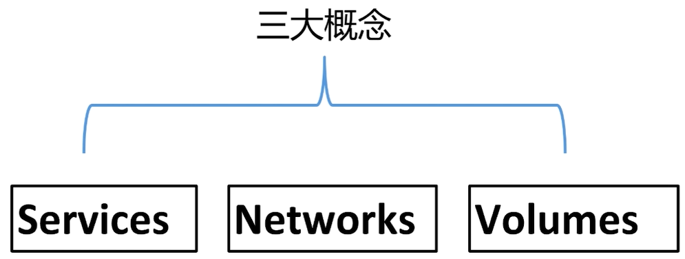
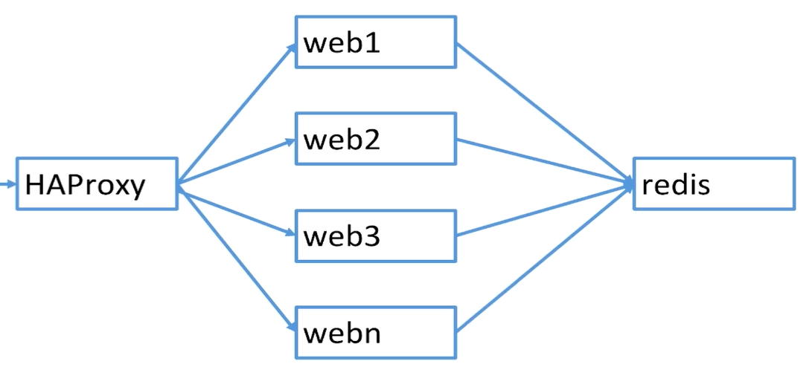
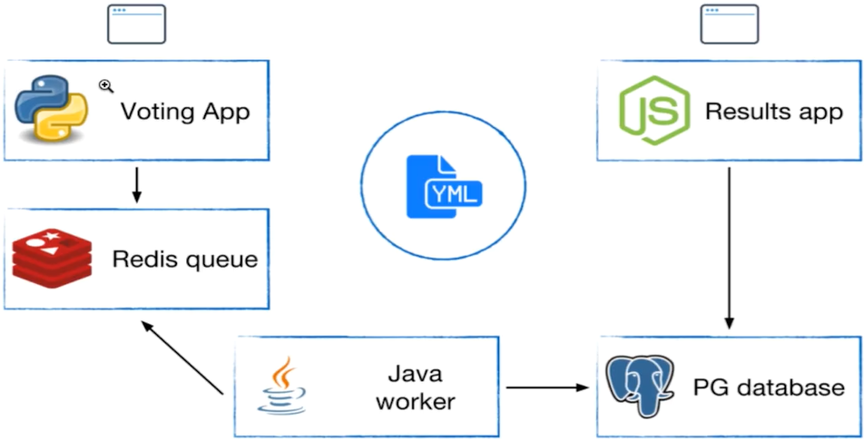

# 案例：部署wordpress

- 安装mysql
  - 注意版本5.7

```bash
docker run -d --name mysql -v mysql-data:/var/lib/mysql -e MYSQL_ROOT_PASSWORD=root -e MYSQL_DATABASE=wordpress mysql:5.7
```

- 安装wordpress
  - 会默认读取环境变量的密码

```bash
docker run -d -e WORDPRESS_DB_HOST=mysql:3306 --link mysql -p 8080:80 wordpress
```

- 访问url：http://192.168.205.10:8080/


# 多容器部署

- 流程
  - 要从Dockerfile build image 或者 Dockerhub拉取image
  - 要创建多个container
  - 要管理这些container，启动停止删除

  

# Docker Compose

 


- Docker Compose 是一个工具
  - 可以通过一个yml文件定义多容器的docker应用
  - 通过一条命令可以根据yml文件的定义去创建或者管理多个容器
  - 一般可以用于本地开发环境使用

 


- 关于版本
  - https://docs.docker.com/compose/compose-file/
  - docker-compose有3.x 和 2.x
    - 3.x可以部署不同虚拟机上容器，可以用于多机，默认单机
      - 可以实现一个app的多个容器，部署在不同的虚假机上
    - 2.x只能部署本地虚拟机容器，只能用于单机

## 安装

- mac & win 安装docker是默认安装docker compose

```bash
docker-compose version
```

- linux下安装
  - https://docs.docker.com/compose/install/
  - For `alpine`, the following dependency packages are needed: `py-pip`, `python-dev`, `libffi-dev`, `openssl-dev`, `gcc`, `libc-dev`, and `make`.

```bash
sudo curl -L "https://github.com/docker/compose/releases/download/1.25.4/docker-compose-$(uname -s)-$(uname -m)" -o /usr/local/bin/docker-compose
sudo chmod +x /usr/local/bin/docker-compose
docker-compose version
```


## 示例：wordpress

- 一个service代表一个container，这个container可以从dockerhub的image创建，或者从本地的Dockerfile build出来的image创建
- Service的启动类似docker run，可以给其指定network和volume，可以给service指定network和volume引用
- 示例

```sh
services:
  db: # 该service的名称是db
    image: postgres:9.4
      volume:
        - "db-data:/var/lib/postgresql/data"
      networks:
        - back-tier
```

- 等价于执行如下命令

```bash
docker run -d --network back-tier -v db-data:/var/lib/postgresql/data postgres:9.4
```

- 示例2

```sh
services:
  worker: # 命名为worker
    build: ./worker # 从本地的Dockerfile进行build
    links:
      - db
      - redis
    networks: # 使用了自定义bridge，容器都是同一个networks，那么links可以不用
      - back-tier
```

- 示例3

```sh
version: '3'

services:

  wordpress:
    image: wordpress
    ports:
      - 8080:80
    depends_on:
      - mysql
    environment: # 类似于-e 环境变量操作
      WORDPRESS_DB_HOST: mysql
      WORDPRESS_DB_PASSWORD: root
    networks: # 连接的网络--network
      - my-bridge

  mysql:
    image: mysql:5.7
    environment:
      MYSQL_ROOT_PASSWORD: root
      MYSQL_DATABASE: wordpress
    volumes:
      - mysql-data:/var/lib/mysql
    networks:
      - my-bridge

volumes:
  mysql-data: # 等价于命令 docker volume create mysql-data

networks:
  my-bridge:
    driver: bridge # 等价于docker network create -d bridge my-bridge
```


## 使用

- 使用docker-compose up 会先执行docker-compose build命令，然后在up

```bash
[vagrant@docker-host wordpress]$ docker-compose -f docker-compose.yml up
# 不添加路径，直接在当前路径下读取docker-compose.yml文件
[vagrant@docker-host wordpress]$ docker-compose up
# 先创建bridge
Creating network "wordpress_my-bridge" with driver "bridge"
# 再创建volume
Creating volume "wordpress_mysql-data" with default driver
# 以当前文件夹名称为前缀+service名称+编号为名称创建容器
Creating wordpress_mysql_1 ... done
Creating wordpress_wordpress_1 ... done
Attaching to wordpress_mysql_1, wordpress_wordpress_1
...
# 此时ctrl+C退出

```


### 后台运行

```sh
[vagrant@docker-host wordpress]$ docker-compose up -d
Starting wordpress_mysql_1 ... done
Starting wordpress_wordpress_1 ... done
```


### 关闭

```sh
[vagrant@docker-host wordpress]$ docker-compose stop
Stopping wordpress_wordpress_1 ... done
Stopping wordpress_mysql_1     ... done
```


### 启动

```bash
[vagrant@docker-host wordpress]$ docker-compose start
Starting mysql     ... done
Starting wordpress ... done
```


### 删除

```sh
[vagrant@docker-host wordpress]$ docker-compose down
Stopping wordpress_wordpress_1 ... done
Stopping wordpress_mysql_1     ... done
Removing wordpress_wordpress_1 ... done
Removing wordpress_mysql_1     ... done
Removing network wordpress_my-bridge
```


### 查看镜像

```sh
[vagrant@docker-host wordpress]$ docker-compose images
      Container         Repository    Tag       Image Id       Size
---------------------------------------------------------------------
wordpress_mysql_1       mysql        5.7      413be204e9c3   455.5 MB
wordpress_wordpress_1   wordpress    latest   0d205d4886fe   540.3 MB

```


### 查看容器

```sh
[vagrant@docker-host wordpress]$  docker-compose ps
        Name                       Command               State          Ports
-------------------------------------------------------------------------------------
wordpress_mysql_1       docker-entrypoint.sh mysqld      Up      3306/tcp, 33060/tcp
wordpress_wordpress_1   docker-entrypoint.sh apach ...   Up      0.0.0.0:8080->80/tcp
```


### 查看帮助

- 注意down和stop的区别

```sh
[vagrant@docker-host wordpress]$ docker-compose
Define and run multi-container applications with Docker.

Usage:
  docker-compose [-f <arg>...] [options] [COMMAND] [ARGS...]
  docker-compose -h|--help

Options:
  -f, --file FILE             Specify an alternate compose file
                              (default: docker-compose.yml)
  -p, --project-name NAME     Specify an alternate project name
                              (default: directory name)
  --verbose                   Show more output
  --log-level LEVEL           Set log level (DEBUG, INFO, WARNING, ERROR, CRITICAL)
  --no-ansi                   Do not print ANSI control characters
  -v, --version               Print version and exit
  -H, --host HOST             Daemon socket to connect to

  --tls                       Use TLS; implied by --tlsverify
  --tlscacert CA_PATH         Trust certs signed only by this CA
  --tlscert CLIENT_CERT_PATH  Path to TLS certificate file
  --tlskey TLS_KEY_PATH       Path to TLS key file
  --tlsverify                 Use TLS and verify the remote
  --skip-hostname-check       Don't check the daemon's hostname against the
                              name specified in the client certificate
  --project-directory PATH    Specify an alternate working directory
                              (default: the path of the Compose file)
  --compatibility             If set, Compose will attempt to convert keys
                              in v3 files to their non-Swarm equivalent
  --env-file PATH             Specify an alternate environment file

Commands:
  build              Build or rebuild services
  config             Validate and view the Compose file
  create             Create services
  # 停止和删除容器，网络，镜像和容器
  down               Stop and remove containers, networks, images, and volumes
  events             Receive real time events from containers
  exec               Execute a command in a running container
  help               Get help on a command
  images             List images
  kill               Kill containers
  logs               View output from containers
  pause              Pause services
  port               Print the public port for a port binding
  ps                 List containers
  pull               Pull service images
  push               Push service images
  restart            Restart services
  rm                 Remove stopped containers
  run                Run a one-off command
  scale              Set number of containers for a service
  start              Start services
  # 停止服务
  stop               Stop services
  top                Display the running processes
  unpause            Unpause services
  up                 Create and start containers
  version            Show the Docker-Compose version information
```


### 进入容器

- 通过service名称进入

```sh
[vagrant@docker-host wordpress]$ docker-compose exec mysql bash
[vagrant@docker-host wordpress]$ docker-compose exec wordpress bash
```


## 示例：flask-redis

- docker-compose.yml

```sh
version: "3"

services:

  redis:
    image: redis

  web:
    build: # 从本地build
      context: . # 从当前文件夹找到Dockerfile进行构建镜像
      dockerfile: Dockerfile
    ports:
      - 8080:5000 # 端口映射
    environment:
      REDIS_HOST: redis
```

- Dockerfile

```bash
FROM python:2.7
LABEL maintaner="stt"
COPY . /app
WORKDIR /app
RUN pip install flask redis
EXPOSE 5000
```

- 使用docker-compose执行

```sh
[vagrant@docker-host flask-redis]$ docker-compose up
```

- 访问：http://192.168.205.10:8080/


## 负载均衡 & 水平扩展 [scale]

- 基于示例：flask-redis
  - 使用--scale进行横向个数扩展

```sh
[vagrant@docker-host flask-redis]$ docker-compose ps
       Name                      Command               State           Ports
-------------------------------------------------------------------------------------
flask-redis_redis_1   docker-entrypoint.sh redis ...   Up      6379/tcp
flask-redis_web_1     python app.py                    Up      0.0.0.0:8080->5000/tcp
```

- 由于端口配置相同，冲突
  - 去除docker-compose.yml下的web端口映射可以启动成功，但是达不到访问的目的

```bash
[vagrant@docker-host flask-redis]$ docker-compose up -d --scale web=3
flask-redis_redis_1 is up-to-date
WARNING: The "web" service specifies a port on the host. If multiple containers for this service are created on a single host, the port will clash.
Starting flask-redis_web_1 ... done
Creating flask-redis_web_2 ...
Creating flask-redis_web_2 ... error
WARNING: Host is already in use by another container
Creating flask-redis_web_3 ... error

ERROR: for flask-redis_web_2  Cannot start service web: driver failed programming external connectivity on endpoint flask-redis_web_2 (84aa0a25206daca48543ea6c2f7e68e864df2cf18f424606dcd68622e080144f): Bind for 0.0.0.0:8080 failed: port is already allocated

ERROR: for flask-redis_web_3  Cannot start service web: driver failed programming external connectivity on endpoint flask-redis_web_3 (54ae22d32ea2573917d4f1d1cb479714fbfd9b81adb25f08f659777e7b8722e8): Bind for 0.0.0.0:8080 failed: port is already allocated

ERROR: for web  Cannot start service web: driver failed programming external connectivity on endpoint flask-redis_web_2 (84aa0a25206daca48543ea6c2f7e68e864df2cf18f424606dcd68622e080144f): Bind for 0.0.0.0:8080 failed: port is already allocated
ERROR: Encountered errors while bringing up the project.
```

- 使用HAProxy组件，进行负载均衡

  

- 修改Dockerfile

```sh
FROM python:2.7
LABEL maintaner="Peng Xiao xiaoquwl@gmail.com"
COPY . /app
WORKDIR /app
RUN pip install flask redis
EXPOSE 80 # 使用80
CMD [ "python", "app.py" ]
```

- 修改docker-compose.yml

```yml
version: "3"

services:

  redis:
    image: redis

  web:
    build:
      context: .
      dockerfile: Dockerfile
    ports: ["8080"] # 此处配置感觉可以删除
    environment:
      REDIS_HOST: redis

  lb:
    image: dockercloud/haproxy
    links:
      - web
    ports: # 将内部的80端口映射到外部
      - 80:80
    volumes:
      - /var/run/docker.sock:/var/run/docker.sock
```

- 启动

```bash
[vagrant@docker-host lb-scale]$ docker-compose up -d --scale web=10
[vagrant@docker-host lb-scale]$ docker-compose ps
      Name                    Command               State                   Ports
-------------------------------------------------------------------------------------------------
lb-scale_lb_1      /sbin/tini -- dockercloud- ...   Up      1936/tcp, 443/tcp, 0.0.0.0:80->80/tcp
lb-scale_redis_1   docker-entrypoint.sh redis ...   Up      6379/tcp
lb-scale_web_1     python app.py                    Up      80/tcp, 0.0.0.0:32772->8080/tcp
lb-scale_web_10    python app.py                    Up      80/tcp, 0.0.0.0:32773->8080/tcp
lb-scale_web_2     python app.py                    Up      80/tcp, 0.0.0.0:32768->8080/tcp
lb-scale_web_3     python app.py                    Up      80/tcp, 0.0.0.0:32776->8080/tcp
lb-scale_web_4     python app.py                    Up      80/tcp, 0.0.0.0:32769->8080/tcp
lb-scale_web_5     python app.py                    Up      80/tcp, 0.0.0.0:32777->8080/tcp
lb-scale_web_6     python app.py                    Up      80/tcp, 0.0.0.0:32774->8080/tcp
lb-scale_web_7     python app.py                    Up      80/tcp, 0.0.0.0:32775->8080/tcp
lb-scale_web_8     python app.py                    Up      80/tcp, 0.0.0.0:32771->8080/tcp
lb-scale_web_9     python app.py                    Up      80/tcp, 0.0.0.0:32770->8080/tcp
```

- 进行访问
  - 注意hostname是变化的，有负载均衡

```bash
[vagrant@docker-host lb-scale]$ curl localhost:80
Hello Container World! I have been seen 1 times and my hostname is 4bffa3b57a33.
[vagrant@docker-host lb-scale]$ curl localhost:80
Hello Container World! I have been seen 2 times and my hostname is 71c17137c92d.
[vagrant@docker-host lb-scale]$ curl localhost:80
Hello Container World! I have been seen 3 times and my hostname is 44587f2d3274.
[vagrant@docker-host lb-scale]$ curl localhost:80
Hello Container World! I have been seen 4 times and my hostname is 15702fc68ea2.
[vagrant@docker-host lb-scale]$ curl localhost:80
Hello Container World! I have been seen 5 times and my hostname is e6f961eac276.
```


# 实践

- chapter6中

- 投票程序，voting app进行投票操作，results app进行结果的获取操作，java worker定时从redis中获取数据写入pg中

 

- docker-compose.yml

```yml
version: "3"

services:
  voting-app:
    build: ./voting-app/.
    volumes:
     - ./voting-app:/app
    ports:
      - "5000:80"
    links:
      - redis
    networks:
      - front-tier # 对外提供访问，需要连接front-tier
      - back-tier

  result-app:
    build: ./result-app/.
    volumes:
      - ./result-app:/app
    ports:
      - "5001:80"
    links:
      - db
    networks:
      - front-tier
      - back-tier

  worker:
    build: ./worker
    links:
      - db
      - redis
    networks:
      - back-tier

  redis:
    image: redis
    ports: ["6379"]
    networks:
      - back-tier

  db:
    image: postgres:9.4
    volumes:
      - "db-data:/var/lib/postgresql/data"
    networks:
      - back-tier

volumes:
  db-data:

networks:
  front-tier: # 没有指明driver则默认bridge
  back-tier:
```


