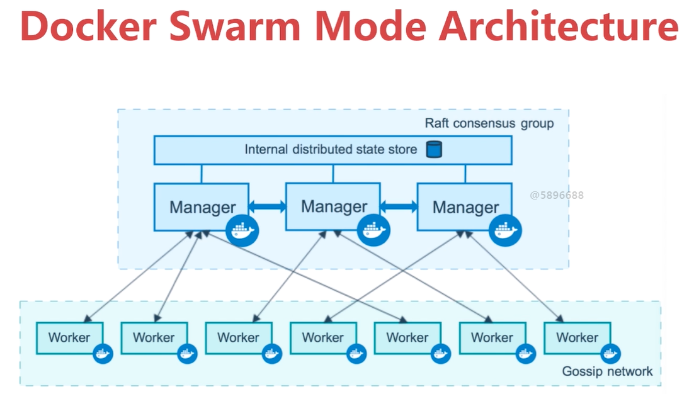
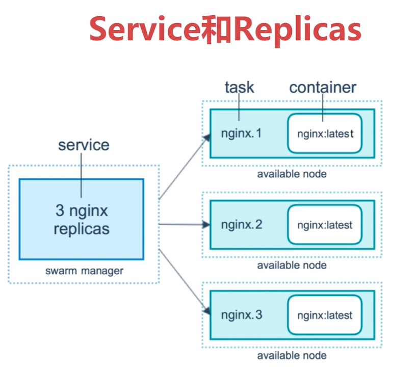
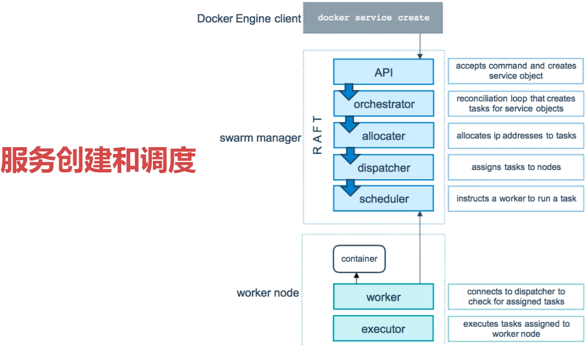
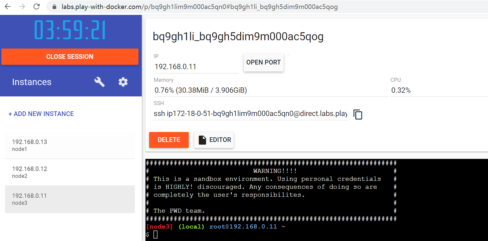
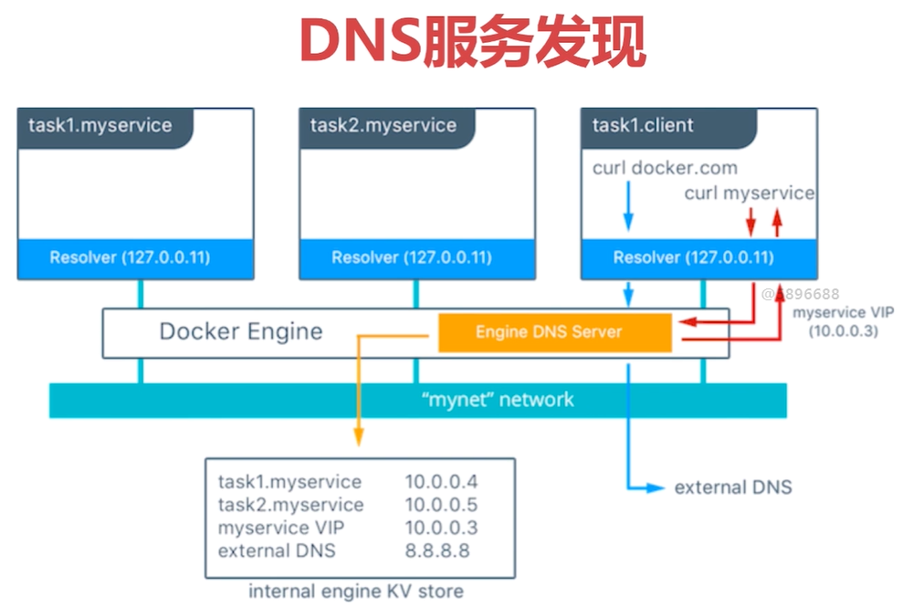
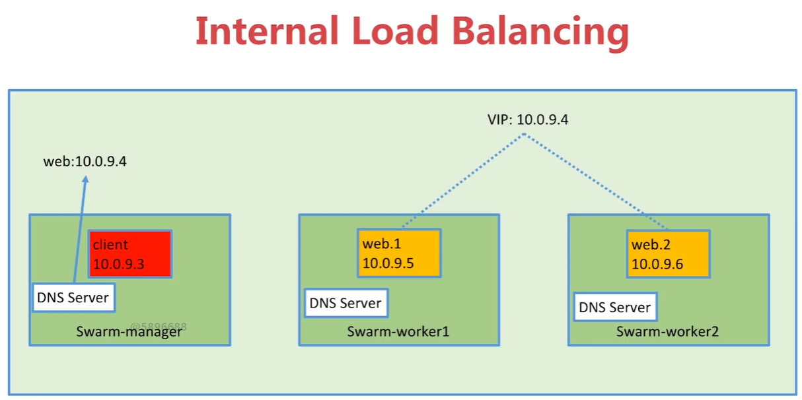
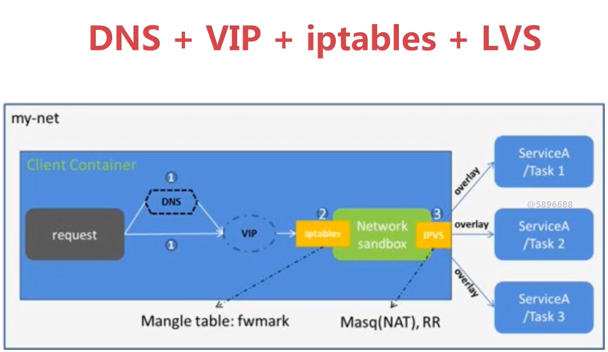
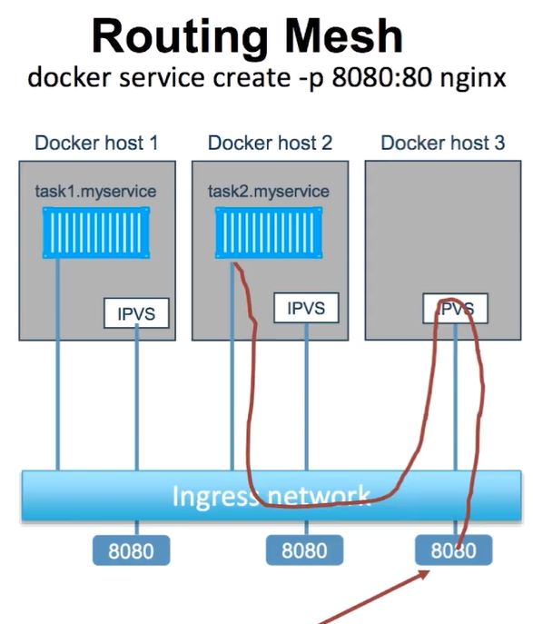
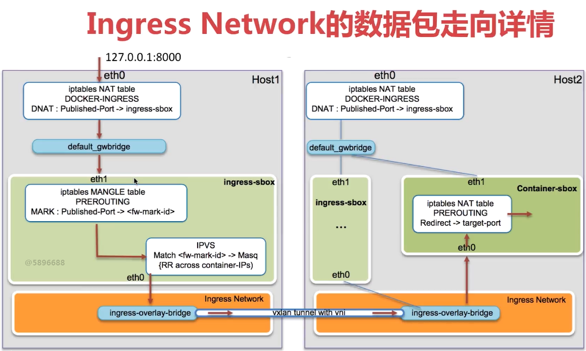
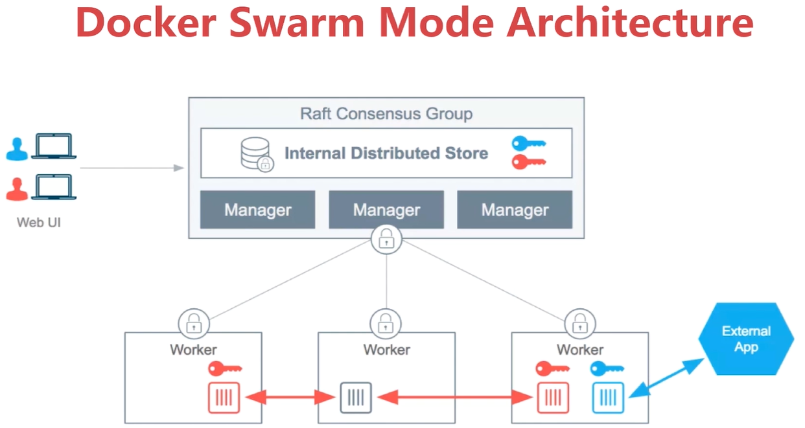

# 介绍

 

- Swarm Mode 
  - docker内置

 

 

- 服务调度
  - manager查看那台节点资源充足，可以被使用，就会使用该节点创建容器



# 搭建

- 3 nodes swarm cluster setup
  - vagrant + virtualbox
  - Docker Machine + VirtualBox
  - Play with docker 
    - https://labs.play-with-docker.com/

vagrantfile

```sh
# -*- mode: ruby -*-
# vi: set ft=ruby :

Vagrant.require_version ">= 1.6.0"

boxes = [
    {
        :name => "swarm-manager",
        :eth1 => "192.168.205.10",
        :mem => "1024",
        :cpu => "1"
    },
    {
        :name => "swarm-worker1",
        :eth1 => "192.168.205.11",
        :mem => "1024",
        :cpu => "1"
    },
    {
        :name => "swarm-worker2",
        :eth1 => "192.168.205.12",
        :mem => "1024",
        :cpu => "1"
    }
]

Vagrant.configure(2) do |config|

  config.vm.box = "centos/7"

  boxes.each do |opts|
      config.vm.define opts[:name] do |config|
        config.vm.hostname = opts[:name]
        config.vm.provider "vmware_fusion" do |v|
          v.vmx["memsize"] = opts[:mem]
          v.vmx["numvcpus"] = opts[:cpu]
        end

        config.vm.provider "virtualbox" do |v|
          v.customize ["modifyvm", :id, "--memory", opts[:mem]]
          v.customize ["modifyvm", :id, "--cpus", opts[:cpu]]
        end

        config.vm.network :private_network, ip: opts[:eth1]
      end
  end

  config.vm.synced_folder "./labs", "/home/vagrant/labs"
  config.vm.provision "shell", privileged: true, path: "./setup.sh"

end
```

setup.sh

```sh
#/bin/sh

# install some tools
sudo yum install -y git vim gcc glibc-static telnet bridge-utils

# install docker
curl -fsSL get.docker.com -o get-docker.sh
sh get-docker.sh

# start docker service
sudo groupadd docker
sudo gpasswd -a vagrant docker
sudo systemctl start docker

rm -rf get-docker.sh
```

- 查看vagrant状态

```bash
$ vagrant status
Current machine states:

swarm-manager             running (virtualbox)
swarm-worker1             running (virtualbox)
swarm-worker2             running (virtualbox)
```


## 初始化 docker swarm

- 进入manager，初始化

```sh
$ vagrant ssh swarm-manager
[vagrant@swarm-manager ~]$ docker swarm
Usage:  docker swarm COMMAND
Manage Swarm
Commands:
  ca          Display and rotate the root CA
  init        Initialize a swarm
  join        Join a swarm as a node and/or manager
  join-token  Manage join tokens
  leave       Leave the swarm
  unlock      Unlock swarm
  unlock-key  Manage the unlock key
  update      Update the swarm

# 使用init，初始化一个swarm
[vagrant@swarm-manager ~]$ docker swarm init --advertise-addr=192.168.205.10
Swarm initialized: current node (lh62y9y1eq8f68gv2vw0ggril) is now a manager.

To add a worker to this swarm, run the following command:

# 其他节点要加入swarm，需要执行如下语句
    docker swarm join --token SWMTKN-1-1qkfuws4hzbg60utpxbp85eijje90g38hh8t5qc3u5qok2uhci-cavhszrxyd182w0o7xcf67jpy 192.168.205.10:2377

To add a manager to this swarm, run 'docker swarm join-token manager' and follow the instructions.
```

- 进入2个worker，加入swarm

```bash
$ vagrant ssh swarm-worker1
$ docker swarm join --token SWMTKN-1-1qkfuws4hzbg60utpxbp85eijje90g38hh8t5qc3u5qok2uhci-cavhszrxyd182w0o7xcf67jpy 192.168.205.10:2377
# 输出
This node joined a swarm as a worker.
```


## 查看节点状态

```sh
# 进入manager
[vagrant@swarm-manager ~]$ docker node ls
ID                            HOSTNAME            STATUS              AVAILABILITY        MANAGER STATUS      ENGINE VERSION
lh62y9y1eq8f68gv2vw0ggril *   swarm-manager       Ready               Active              Leader              19.03.8
vj5d3pi0bz68phbu6btyfuwhh     swarm-worker1       Ready               Active                                  19.03.8
1a9wpbhglcu2cwqs0ybz9urwf     swarm-worker2       Ready               Active                                  19.03.8
```


## 使用docker-machine搭建

```bash
docker-machine create swarm-manager # 创建一个manager节点，然后依次创建worker节点进行配置
```


## 使用play with docker

- url https://labs.play-with-docker.com/p/bq9ggr5im9m000ac5qm0
- 只有4个小时有效时间

 


# 创建service

- 使用docker service create 命令
  - 类似于docker run，但是docker run是在本地创建一个容器

```bash
$ docker service create
"docker service create" requires at least 1 argument.
See 'docker service create --help'.

Usage:  docker service create [OPTIONS] IMAGE [COMMAND] [ARG...]

$ docker service create --name demo busybox sh -c "while true;do sleep 3600;done"
```


# 查看service列表

```sh
$ docker service ls
ID                  NAME                MODE                REPLICAS            IMAGE               PORTS
dbrc6wpep3sg        demo                replicated          1/1                 busybox:latest
```


# 查看service详情

- 查看容器在哪台机器上启动

```sh
$ docker service ps demo
ID                  NAME                IMAGE               NODE                DESIRED STATE       CURRENT STATE            ERROR                             PORTS
tq6iy7fp8wm5        demo.1              busybox:latest      swarm-worker1       Running             Running 5 minutes ago      
```

- 在swarm-worker1上查看该容器情况
  - 注意名称和manager上查看的不同

```sh
$ docker ps
CONTAINER ID        IMAGE               COMMAND                  CREATED             STATUS              PORTS               NAMES
fbba0e32447c        busybox:latest      "sh -c 'while true;d…"   7 minutes ago       Up 7 minutes                            demo.1.tq6iy7fp8wm5jhme1d3jzp9o7
```


# service的水平扩展

- 可以做到横向扩展，同时可以做到修复
  - 保证了系统是有效的

```sh
# 在swarm manager上执行
$ docker service scale demo=5
$ docker service ls
ID                  NAME                MODE                REPLICAS            IMAGE               PORTS
dbrc6wpep3sg        demo                replicated          5/5                 busybox:latest
```

- REPLICAS
  - 分母是scale大小
  - 分子是正在running的个数

- 查看状态

```sh
$ docker service ps demo
ID                  NAME                IMAGE               NODE                DESIRED STATE       CURRENT STATE             
tq6iy7fp8wm5        demo.1              busybox:latest      swarm-worker1       Running             Running 12 minutes ago       
o0zwglcnxz13        demo.2              busybox:latest      swarm-worker1       Running             Running about a minute ago   
bmqofo55983c        demo.3              busybox:latest      swarm-worker2       Running             Running about a minute ago  
g3ogjhcy9sne        demo.4              busybox:latest      swarm-manager       Running             Running about a minute ago  
rwdd8sbwe3kt        demo.5              busybox:latest      swarm-manager       Running             Running about a minute ago
```

- 当在一个虚拟机中强制删除一个容器
  - 经过一段时间后，自己会恢复

```sh
$ docker service ls
ID                  NAME          MODE                REPLICAS        IMAGE
dbrc6wpep3sg        demo          replicated          4/5             busybox:latest
```


# 删除service

```bash
$ docker service rm demo
```


# 实践：通过swarm安装wordpress


## 创建overlay network

- 由于节点可能不在同一个虚拟机上，需要建立一个overlay网络进行通信

```sh
[vagrant@swarm-manager ~]$ docker network create -d overlay demo
f1rwo263d00l35wehzayb7grx
# 查看网络是否建立成功
[vagrant@swarm-manager ~]$ docker network ls
NETWORK ID          NAME                DRIVER              SCOPE
8d1d5e7cb125        bridge              bridge              local
f1rwo263d00l        demo                overlay             swarm
7855bf0f6f08        docker_gwbridge     bridge              local
d25578c23f18        host                host                local
2v863qukoj1x        ingress             overlay             swarm
d656352966dc        none                null                local
# 在其他主机上查看没有
[vagrant@swarm-worker1 ~]$ docker network ls
NETWORK ID          NAME                DRIVER              SCOPE
da763ccb888b        bridge              bridge              local
ab2ea70b84c2        docker_gwbridge     bridge              local
cca56de9d417        host                host                local
2v863qukoj1x        ingress             overlay             swarm
44f3cf8f561f        none                null                local
```


## 创建mysql的service

```bash
docker service create --name mysql \
--env MYSQL_ROOT_PASSWORD=root \
--env MYSQL_DATA_BASE=wordpress \
--network demo \ # 使用overlay网络
--mount type=volume,source=mysql-data,destination=/var/lib/mysql \
mysql:5.7
```


## 创建wordpress的service

```sh
docker service create --name wordpress \
-p 80:80 \
--env WORDPRESS_DB_PASSWORD=root \
--env WORDPRESS_DB_HOST=mysql \
--network demo \
wordpress
```

- 查看安装情况

```sh
[vagrant@swarm-manager ~]$ docker service ls
ID                  NAME                MODE                REPLICAS            IMAGE               PORTS
m6za0nllrp3j        mysql               replicated          1/1                 mysql:latest
jltnni0o28w0        wordpress           replicated          1/1                 wordpress:latest    *:80->80/tcp

[vagrant@swarm-manager ~]$ docker service ps wordpress
ID                  NAME                IMAGE               NODE                DESIRED STATE       CURRENT STATE            ERROR               PORTS
n0p9sdz92xij        wordpress.1         wordpress:latest    swarm-worker2       Running             Running 14 minutes ago
```

- 访问 http://192.168.205.12/ ，访问 http://192.168.205.11/，访问 http://192.168.205.10/
  - 都可以正常访问


## 关于网络

- 此时查看worker上的网络

```sh
[vagrant@swarm-worker2 ~]$ docker network ls
NETWORK ID          NAME                DRIVER              SCOPE
0d1ed4e5d7fa        bridge              bridge              local
f1rwo263d00l        demo                overlay             swarm # 出现demo网络
5b2d3b1f1556        docker_gwbridge     bridge              local
63ea59fac9db        host                host                local
2v863qukoj1x        ingress             overlay             swarm
0a2a0c26659a        none                null                local

# worker1上没有任何容器服务，没有demo网络
[vagrant@swarm-worker1 ~]$ docker network ls
NETWORK ID          NAME                DRIVER              SCOPE
da763ccb888b        bridge              bridge              local
ab2ea70b84c2        docker_gwbridge     bridge              local
cca56de9d417        host                host                local
2v863qukoj1x        ingress             overlay             swarm
44f3cf8f561f        none                null                local
```

- swarm自己会维护一个网络映射，不需要之前那样安装etcd存储网络信息


# Routing Mesh

由internal 和 ingress 组成


## Internal

- Container 和 Container 之间的访问==通过overlay网络==，通过虚拟ip（vip）

- 不同的service可以通过服务名称相互通信
- 在DNS中服务中创建相应的记录
  - 服务的名称 和 ==虚拟ip（vip）==
    - 使用虚拟ip与本地ip进行解耦，由于容器所在的虚拟机可能会变化，因此如果存储虚拟机ip，当发生变化时，需要更新DNS服务，造成耦合
  - vip  和实际虚拟机ip之间的关系==使用LVS来维护==

 

示例

- 首先确定有一个overlay的网络

```sh
[vagrant@swarm-manager ~]$ docker network ls
NETWORK ID          NAME                DRIVER              SCOPE
...
f1rwo263d00l        demo                overlay             swarm
...
```

- 创建容器，使用jwilder/whoami镜像，功能是访问8000端口返回容器的hostname

```sh
[vagrant@swarm-manager ~]$ docker service create \
--name whoami -p 8000:8000 --network demo -d jwilder/whoami
[vagrant@swarm-manager ~]$ curl 127.0.0.1:8000
I'm f04874faadbc

# 查看在哪个节点上执行,在worker2 上执行whoami
[vagrant@swarm-manager ~]$ docker service ps whoami
ID                  NAME                IMAGE                   NODE                DESIRED STATE       CURRENT STATE            ERROR               PORTS
ef368z7vrwtd        whoami.1            jwilder/whoami:latest   swarm-worker2       Running             Running 46 seconds ago

# 在该节点上运行,结果一致
[vagrant@swarm-worker2 ~]$ curl 127.0.0.1:8000
I'm f04874faadbc
```

- 再创建一个容器，使用busybox镜像

```sh
[vagrant@swarm-manager ~]$ docker service create \
--name client --network demo -d busybox sh -c "while true;do sleep 3600;done"
# 查看容器的位置，与服务
$ docker service ls
$ docker service ps client # 此时busybox在worker1
$ docker ps 
```

- 在虚拟机worker1的busybox里面ping之前的whoami服务

```sh
[vagrant@swarm-worker1 ~]$ docker exec -it 34a2 sh
/ # ping whoami
PING whoami (10.0.1.15): 56 data bytes # 此处10.0.1.15 是vip
64 bytes from 10.0.1.15: seq=0 ttl=64 time=0.057 ms
...
```

- 扩展whoami

```sh
docker service scale whoami=3

# 查看详细
docker service ps whoami
ID                  NAME                IMAGE                   NODE                DESIRED STATE       CURRENT STATE                ERROR               PORTS
i6sgeogk2dec        whoami.1            jwilder/whoami:latest   swarm-manager       Running             Running about an hour ago
szvi09tldnse        whoami.2            jwilder/whoami:latest   swarm-worker2       Running             Running 41 seconds ago
vpp01gy1u7cq        whoami.3            jwilder/whoami:latest   swarm-worker1       Running             Running 23 seconds ago
```

- 进入busybox继续ping

```sh
[vagrant@swarm-worker2 ~]$ docker exec -it a5c574824b5c sh
/ # ping whoami
PING whoami (10.0.1.15): 56 data bytes # ip地址依然不变
64 bytes from 10.0.1.15: seq=0 ttl=64 time=0.051 ms
...
```

- 查看网络地址

```sh
# 进入一个whoami查看ip a
[vagrant@swarm-worker2 ~]$ docker exec -it 1e315fdffaae sh
/app # nslookup whoami
nslookup: can't resolve '(null)': Name does not resolve

Name:      whoami
Address 1: 10.0.1.15

/app # ip a
1: lo: <LOOPBACK,UP,LOWER_UP> mtu 65536 qdisc noqueue state UNKNOWN qlen 1000
    link/loopback 00:00:00:00:00:00 brd 00:00:00:00:00:00
    inet 127.0.0.1/8 scope host lo
       valid_lft forever preferred_lft forever
43: eth1@if44: <BROADCAST,MULTICAST,UP,LOWER_UP,M-DOWN> mtu 1450 qdisc noqueue state UP
    link/ether 02:42:0a:00:00:0f brd ff:ff:ff:ff:ff:ff
    inet 10.0.0.15/24 brd 10.0.0.255 scope global eth1
       valid_lft forever preferred_lft forever
45: eth2@if46: <BROADCAST,MULTICAST,UP,LOWER_UP,M-DOWN> mtu 1500 qdisc noqueue state UP
    link/ether 02:42:ac:12:00:05 brd ff:ff:ff:ff:ff:ff
    inet 172.18.0.5/16 brd 172.18.255.255 scope global eth2
       valid_lft forever preferred_lft forever
47: eth0@if48: <BROADCAST,MULTICAST,UP,LOWER_UP,M-DOWN> mtu 1450 qdisc noqueue state UP
    link/ether 02:42:0a:00:01:1a brd ff:ff:ff:ff:ff:ff
    inet 10.0.1.26/24 brd 10.0.1.255 scope global eth0 # 自身容器的地址
       valid_lft forever preferred_lft forever
```

- 10.0.1.15 与  多个容器的ip做映射，在访问10.0.1.15时，做负载均衡，轮询选择容器

```sh
# 连续访问3次，每次切换不同的容器访问
[vagrant@swarm-manager ~]$ curl 127.0.0.1:8000
I'm 6ef102806948
[vagrant@swarm-manager ~]$ curl 127.0.0.1:8000
I'm 1e315fdffaae
[vagrant@swarm-manager ~]$ curl 127.0.0.1:8000
I'm e5b529e6cc9c
```

 


- 访问的过程

 

- LVS
  - linux virtual server
  - 实现在系统级别的负载均衡调用
  - 在linux内核中使用


## Ingress

- 如果服务有绑定接口，此服务可以通过任意swarm节点的相应接口访问
- 外部访问的负载均衡
- 服务端口被暴露到各个swarm节点上
- 内部通过ipvs进行负载均衡

 

- 示例

```sh
# 减少一个，worker1上没有部署该服务
$ docker service scale whoami=2
# 在worker1上进行调用，依然可以访问
curl 127.0.0.1:8000
```

- 在worker1上查看转发的规则
  - 本地端口被转发172.18.0.2，该端口被ingress-sbox使用，而刚好该ingress-sbox在worker1上

```sh
[vagrant@swarm-worker1 ~]$ sudo iptables -nL -t nat
...
Chain DOCKER-INGRESS (2 references)
target     prot opt source               destination
DNAT       tcp  --  0.0.0.0/0            0.0.0.0/0   tcp dpt:8000 to:172.18.0.2:8000
...
# 查看网络情况，本地网络该ip与转发的ip处于同一个网段，而且都是属于docker_gwbridge
[vagrant@swarm-worker1 ~]$ ip a
...
4: docker_gwbridge: <BROADCAST,MULTICAST,UP,LOWER_UP>..
    link/ether 02:42:e3:73:95:b3 brd ff:ff:ff:ff:ff:ff
    inet 172.18.0.1/16 brd 172.18.255.255 scope global docker_gwbridge
       valid_lft forever preferred_lft forever
    inet6 fe80::42:e3ff:fe73:95b3/64 scope link
       valid_lft forever preferred_lft forever
...

# 查看docker_gwbridge
$ brctl show
[vagrant@swarm-worker1 ~]$ docker network inspect docker_gwbridge
[
    {
        "Name": "docker_gwbridge",
...
        "ConfigOnly": false,
        "Containers": {
        # ingress-sbox 是swarm开启的一个namespace
            "ingress-sbox": {
                "Name": "gateway_ingress-sbox",
                "EndpointID": "xxx",
                "MacAddress": "02:42:ac:12:00:02",
                "IPv4Address": "172.18.0.2/16",
                "IPv6Address": ""
            }
        },
     ... 
```

- 进入该namespace

```sh
[vagrant@swarm-worker1 ~]$ sudo ls /var/run/docker/netns
1-2v863qukoj  ingress_sbox

# 进入ingress_sbox查看防护墙如何执行
[vagrant@swarm-worker1 ~]$ sudo nsenter --net=/var/run/docker/netns/ingress_sbox
[root@swarm-worker1 vagrant]# iptables -nL -t mangle
# 需要使用ipvsadm 进行查看，在ingress_sbox做了负载均衡，轮询选择目的容器
```

 


# docker stack 部署

- 集群部署docker-compose.yml文件
  - docker-compose命令是在单机上部署多个容器
- docker stack 操作的docker-compose.yml文件不能有build命令，无法对程序进行build操作

- 示例

```yml
version: '3'

services:

  web:
    image: wordpress
    ports:
      - 8080:80
    environment:
      WORDPRESS_DB_HOST: mysql
      WORDPRESS_DB_PASSWORD: root
    networks: # 配置overlay网络
      - my-network
    depends_on:
      - mysql
    deploy:
      mode: replicated
      replicas: 3 # 创建3个副本
      restart_policy: # 重启的策略
        condition: on-failure
        delay: 5s
        max_attempts: 3
      update_config: # 更新操作的配置
        parallelism: 1
        delay: 10s

  mysql:
    image: mysql:5.7
    environment:
      MYSQL_ROOT_PASSWORD: root
      MYSQL_DATABASE: wordpress
    volumes:
      - mysql-data:/var/lib/mysql
    networks: # 使用overlay网络
      - my-network
    deploy:
      mode: global # mysql不允许扩展，不做replicated
      placement: # 部署位置
        constraints: # 限制在 manager节点上
          - node.role == manager

volumes:
  mysql-data:

networks:
  my-network:
    driver: overlay # 注意在swarm中需要使用overlay，而不能使用bridge
```

- 启动

```sh
[vagrant@swarm-manager wordpress]$ docker stack deploy wordpress --compose-file=docker-compose.yml
Creating network wordpress_my-network
Creating service wordpress_web
Creating service wordpress_mysql

[vagrant@swarm-manager wordpress]$ docker stack ls
NAME                SERVICES            ORCHESTRATOR
wordpress           2                   Swarm

[vagrant@swarm-manager wordpress]$ docker stack ps wordpress
ID                  NAME                                        IMAGE               NODE                DESIRED STATE       CURRENT STATE              ERROR               PORTS
toq55p9b2tgl        wordpress_mysql.lh62y9y1eq8f68gv2vw0ggril   mysql:5.7           swarm-manager       Running             Preparing 16 seconds ago
fgpicdorevy0        wordpress_web.1                             wordpress:latest    swarm-manager       Running             Running 29 seconds ago
y6l421xp31i1        wordpress_web.2                             wordpress:latest    swarm-worker2       Running             Running 28 seconds ago
i1uxl53pjknk        wordpress_web.3                             wordpress:latest    swarm-worker1       Running             Preparing 30 seconds ago

[vagrant@swarm-manager wordpress]$ docker stack services wordpress
ID                  NAME                MODE                REPLICAS            IMAGE               PORTS
1vhseq3qsx8y        wordpress_web       replicated          3/3                 wordpress:latest    *:8080->80/tcp
rfndb4lxs4wr        wordpress_mysql     global              1/1                 mysql:5.7

```

- 删除

```sh
[vagrant@swarm-manager wordpress]$ docker stack rm wordpress
Removing service wordpress_mysql
Removing service wordpress_web
Removing network wordpress_my-network
```


# docker secret 管理和使用

- 什么是secret
  - 用户和密码
  - SSH Key
  - TLS 认证
  - 其他数据
- secret management
  - 存在swarm manager节点raft database里面
  - secret 可以assign 给一个service，该service就可以看到该secret
  - 在container内部，secret看起来像文件，但实际是存在内存中
- 将secret存储在manager内部的分布式存储中，当service要使用secret，分配一个权限可访问到该secret

 

- 示例

```sh
# 创建一个文件，如password
# 创建一个secret
[vagrant@swarm-manager secret-example]$ docker secret create my-pw password
quhn3tpuq05muqs5xfnfms5hq

# 创建完成后可以删除password文件
# 通过命令的输入的方式创建secret
[vagrant@swarm-manager secret-example]$ echo "stt" | docker secret create my-pw2 -
gaxm9ao21cq4y1gv8kengm11e

[vagrant@swarm-manager secret-example]$ docker secret ls
ID                          NAME     DRIVER    CREATED             UPDATED
quhn3tpuq05muqs5xfnfms5hq   my-pw              2 minutes ago       2 minutes ago
gaxm9ao21cq4y1gv8kengm11e   my-pw2             2 seconds ago       2 seconds ago
```

- 创建service，在service中读取传入的secret文件
  - 可以通过多个--secret传入多个参数

```sh
$ docker service create --name demo --secret my-pw busybox sh -c "while true;do sleep 3600;done"

# 进入到容器中
[root@swarm-worker1 vagrant]# docker exec -it f479ecf27c82 sh
/ # cd /run/secrets/
/run/secrets # ls
my-pw
/run/secrets # cat my-pw
adminadmin/
```


## 在docker stack中使用

```yml
version: '3'

services:

  web:
    image: wordpress
    ports:
      - 8080:80
    secrets:
      - my-pw # 设置secret文件
    environment:
      WORDPRESS_DB_HOST: mysql
      WORDPRESS_DB_PASSWORD_FILE: /run/secrets/my-pw # 读取secret文件信息
    networks:
      - my-network
    depends_on:
      - mysql
    deploy:
      mode: replicated
      replicas: 3
      restart_policy:
        condition: on-failure
        delay: 5s
        max_attempts: 3
      update_config:
        parallelism: 1
        delay: 10s

  mysql:
    image: mysql
    secrets:
      - my-pw
    environment:
      MYSQL_ROOT_PASSWORD_FILE: /run/secrets/my-pw
      MYSQL_DATABASE: wordpress
    volumes:
      - mysql-data:/var/lib/mysql
    networks:
      - my-network
    deploy:
      mode: global
      placement:
        constraints:
          - node.role == manager

volumes:
  mysql-data:

networks:
  my-network:
    driver: overlay
    
# 如果事先没有创建secret，则需要如下配置，不太推荐，推荐事先创建好secret
# secrets:
#  my-pw:
#    file: ./password
```


# service的更新

- 如对生产上的service进行更新
- 示例
  - 前提是要有个overlay的network，如名称为demo

```sh
docker service create --name web --publish 8080:5000 --network demo \
xiaopeng163/python-flask-demo:1.0
docker service scale web=2 

# 编写脚本访问url
sh -c "while true;do curl 127.0.0.1:8080 && sleep 1;done"

# 示例，执行image更新,docker swarm会先停止一个，更新一个，再停止另一个
docker service update --image xiaopeng163/python-flask-demo:2.0 web

# 此时1.0和2.0共存，按道理是不允许的，因为版本之间是有差异的，会导致数据和业务的错误
# 示例，更新暴露的端口
docker service update --publish-rm 8080:5000 --publish-add 8088:5000 web
```

- 注意对于docker stack，只需要更新docker-compose.yml文件，再执行docker stack deploy即可