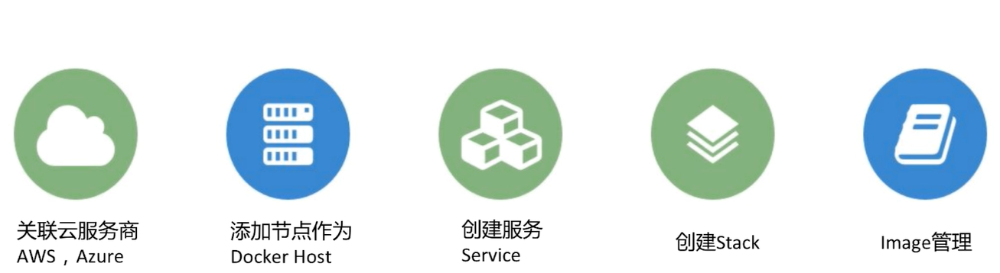
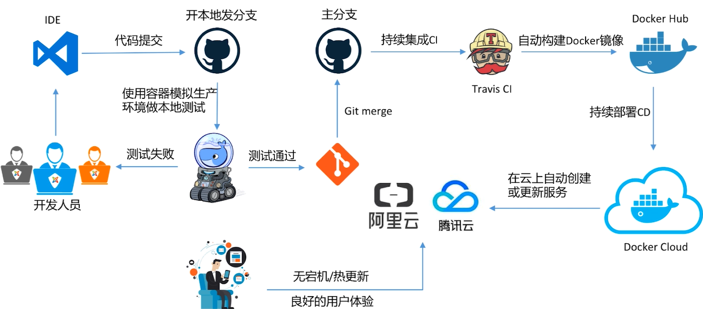

# Docker Cloud

- CaaS Container as a Service
- 提供容器的管理，编排，部署的托管服务，网页操作docker命令
- 主要模块

 

- 2种模式
  - standard模式，一个node一个docker host，host之间没有组成swarm cluster
  - swarm 模式，多个node组成swarm cluster

- devOps

 