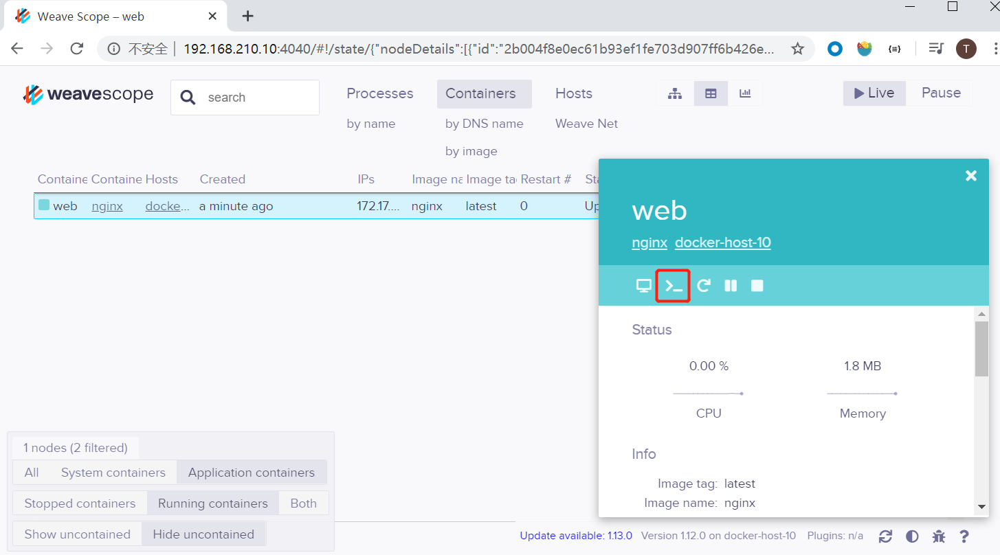
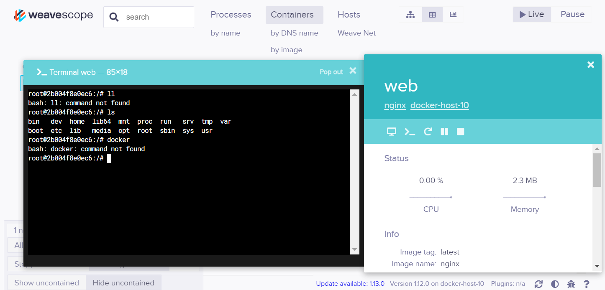
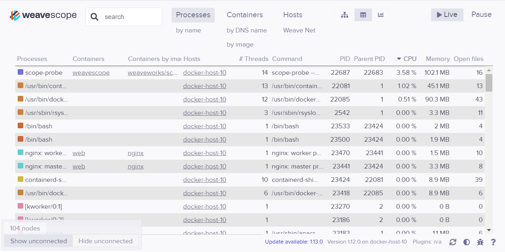

- 使用chapter11中的vagrantfile

# 查看容器内进程 [docker top]

```sh
$ docker top f195554ab10b
UID                 PID                 PPID                C                   STIME               TTY                 TIME                CMD
root                22665               22648               0                   14:54               ?                   00:00:00            /home/weave/runsvinit
root                22682               22665               0                   14:54               ?                   00:00:00            /sbin/runsvdir /etc/service
root                22683               22682               0                   14:54               ?                   00:00:00            runsv probe
```


# 查看容器运行的状态 [docker stats]

```sh
$ docker stats
CONTAINER ID        NAME                CPU %               MEM USAGE / LIMIT     MEM %               NET I/O             BLOCK I/O           PIDS
f195554ab10b        weavescope          4.34%               127.4MiB / 1.795GiB   6.93%               0B / 0B             0B / 0B             32
```


# weavescope 监控

- 可视化和管理Docker，K8s
- https://github.com/weaveworks/scope


## install

```
[vagrant@docker-host-10 ~]$ sudo curl -L git.io/scope -o /usr/local/bin/scope
  % Total    % Received % Xferd  Average Speed   Time    Time     Time  Current
                                 Dload  Upload   Total   Spent    Left  Speed
  0     0    0     0    0     0      0      0 --:--:-- --:--:-- --:--:--     0
  0     0    0     0    0     0      0      0 --:--:--  0:00:02 --:--:--     0
  0     0    0     0    0     0      0      0 --:--:--  0:00:03 --:--:--     0
  0     0    0   595    0     0    121      0 --:--:--  0:00:04 --:--:--   958
100 11672  100 11672    0     0   1816      0  0:00:06  0:00:06 --:--:-- 10620
[vagrant@docker-host-10 ~]$ sudo chmod +x /usr/local/bin/scope
```


## start

```
[vagrant@docker-host-10 ~]$ scope launch 192.168.210.10
Unable to find image 'weaveworks/scope:1.8.0' locally
1.8.0: Pulling from weaveworks/scope
550fe1bea624: Pull complete
d9c4209a46c9: Pull complete
2c163db88610: Pull complete
45af6fee2cfc: Pull complete
39ebea0d0b9d: Pull complete
a989ceae5afa: Pull complete
4291b1d894ad: Pull complete
6e7c71c082c6: Pull complete
e19632c37180: Pull complete
07f034823a09: Pull complete
Digest: sha256:608691da855b66a625530ef1d5fb87fb6acc50e6e4b7cf348e515a8ff181335e
Status: Downloaded newer image for weaveworks/scope:1.8.0
5eb76659933f1d7cbbd78673b7ba821e05d12c129111d5ba56ab4f68726f60c7
Scope probe started
Weave Scope is listening at the following URL(s):
  * http://192.168.210.10:4040/
  * http://10.0.2.15:4040/
```


## stop

```sh
scope stop
```


## 使用

- 访问url http://192.168.210.10:4040/


### 关于container

- 在右下角可以进行过滤操作

 

- 点击图标可以进入shell，等价于执行了exec -it 进入容器




### 关于process




## 使用scope监控2个docker节点

- 将监控的2台docker上都安装weavescope，并且关闭状态
- 启动时添加2个docker的地址，此时访问http://192.168.99.100:4040/

```sh
/usr/local/bin/scope launch 192.168.99.100 192.168.210.10
```

