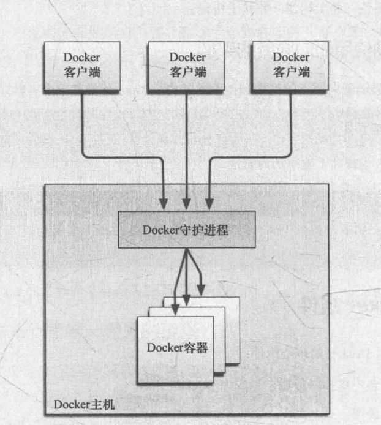

- CS架构
- 服务端和客户端
- 有一个守护进程---也称为Docker引擎
- 含命令行工具，和restful api
- 本地docker客户端不仅仅可以连接本地的docker服务，也可以连接其他的docker服务

 

- 守护进程

  - 安装完成后，默认立刻启动Docker守护进程
  - 监听/var/run/docker.sock 该Unix套接字文件
  - 查看docker状态

  ```sh
  [vagrant@docker-host ~]$ service docker status
  Redirecting to /bin/systemctl status docker.service
  ● docker.service - Docker Application Container Engine
     Loaded: loaded (/usr/lib/systemd/system/docker.service; disabled; vendor preset: disabled)
     Active: active (running) since Mon 2020-04-20 02:33:43 UTC; 22h ago
       Docs: https://docs.docker.com
   Main PID: 2890 (dockerd)
      Tasks: 15
     Memory: 141.3M
     CGroup: /system.slice/docker.service
             ├─2890 /usr/bin/dockerd -H fd:// --containerd=/run/containerd/containerd.sock
             └─3207 /usr/bin/docker-proxy -proto tcp -host-ip 0.0.0.0 -host-port 3306 -container-ip 172.18.0.2 -container-port 3306
  ```

- 启动和停止docker进程

```sh
service docker start
service docker stop
```

- 浏览/var/lib/docker目录查看结构
  - 存放着docker镜像，容器，以及容器的配置
  - 所有容器都保存在containers目录下

