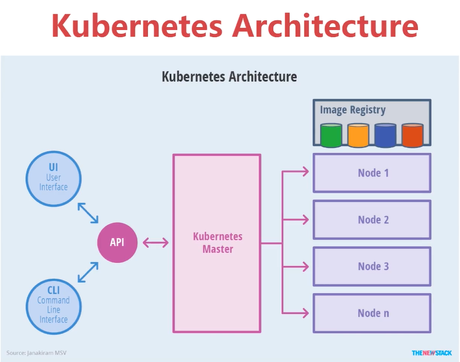
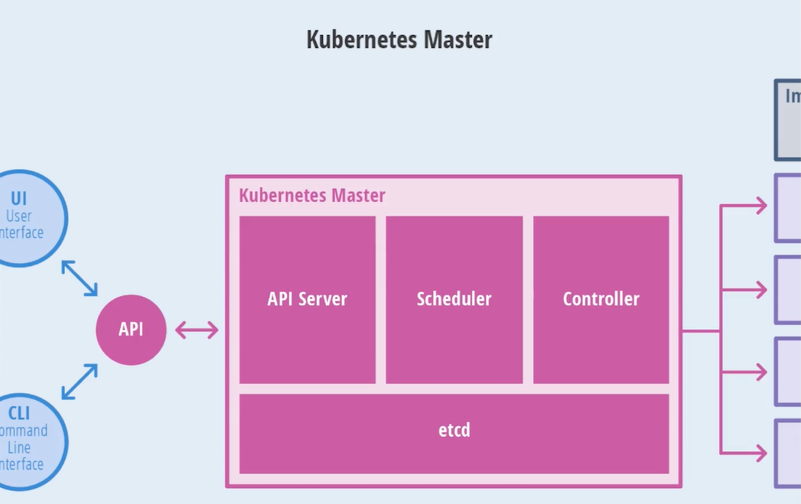
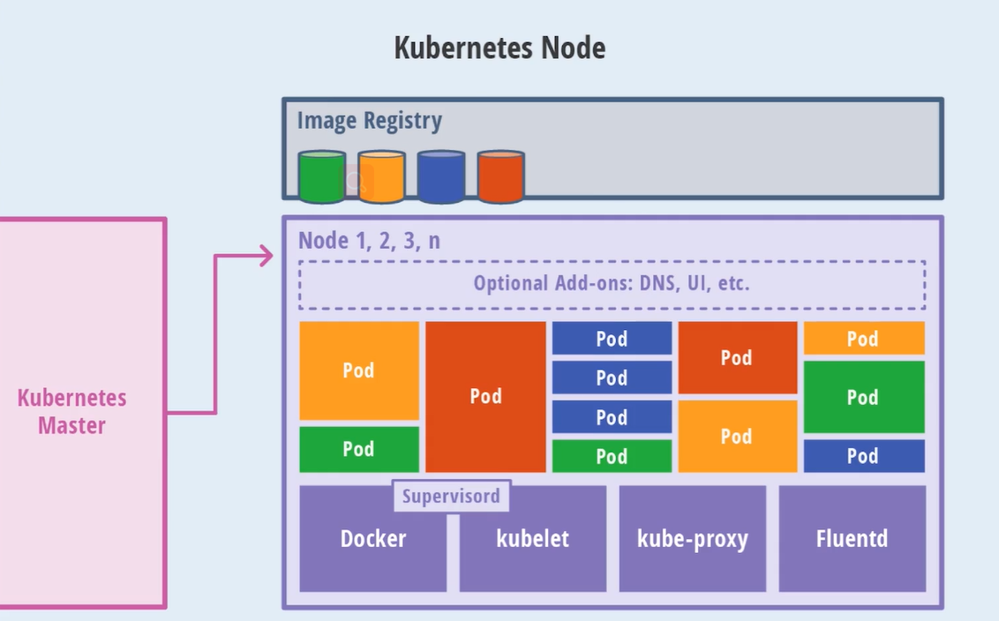
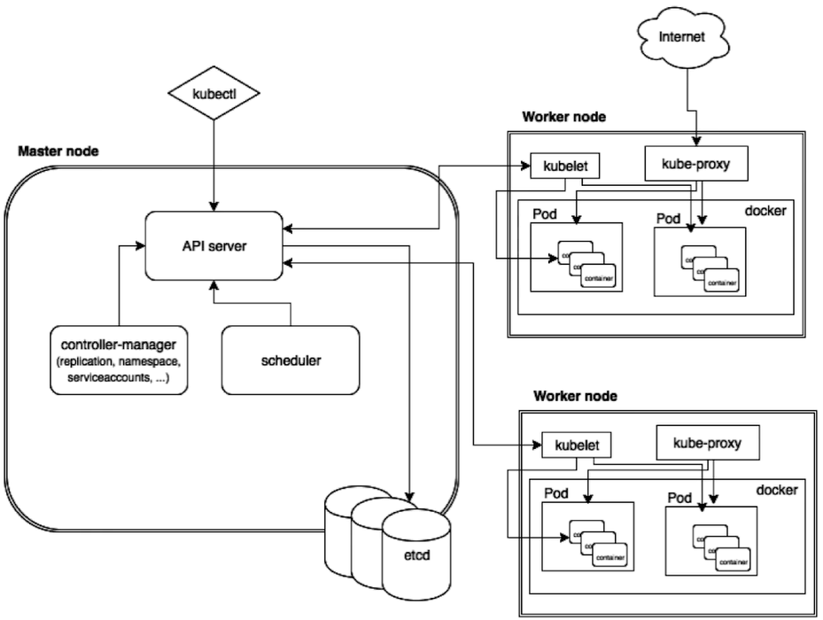

# 介绍

 

## master节点

 

## node 节点

 

### pod的概念

- 容器内调度的最小单位
- 具有相同的namespace的container的组合，包含
  - user namespace
  - network namespace（主要）

### Docker

- 容器的技术
- 也有其他的容器技术的支持

### kubelet

- master节点控制node节点，如node上创建pod，通过kubelet进行创建容器的管理等
  - 类似于一个master的代理

### kube-proxy

- 与网络有关
- 暴露接口给外部访问，需要有proxy做代理和转发，也可以做负载均衡

### Fluentd

- 日志的采集

### 其他插件

- DNS
- UI 等

## image registry

## 操作流程

