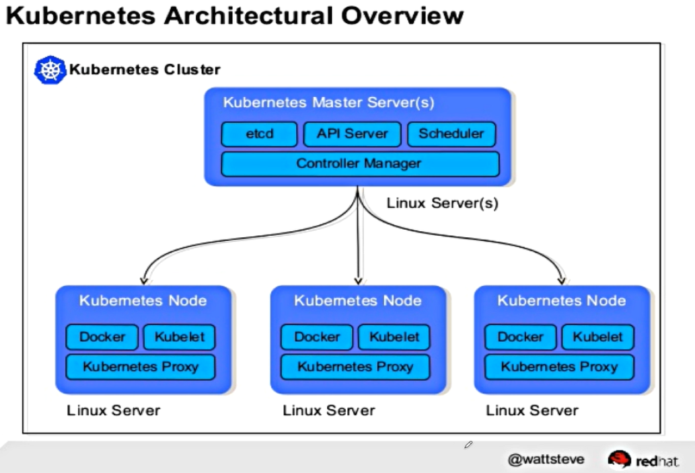
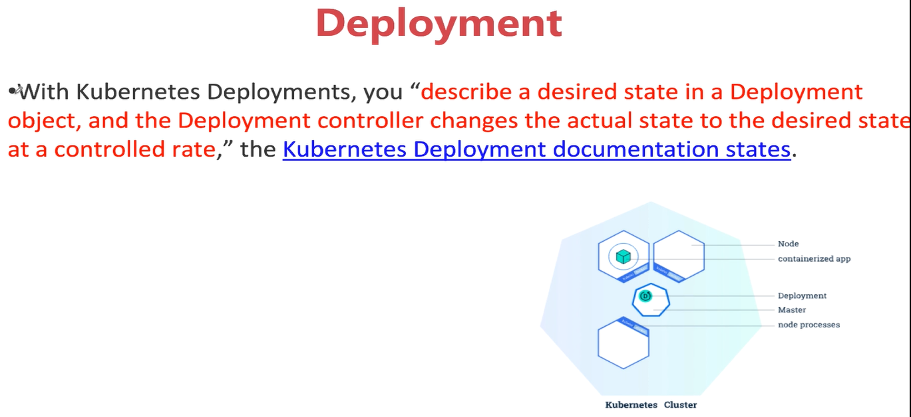

# 介绍

- 基本架构
  - Master节点
    - etcd，分布式key-value数据库
    - api server， 对外暴露的接口，kubectl连接api server控制集群
    - scheduler，创建pod，决定具体放在哪个node上，使用调度算法进行调度
    - controller manager，

 


## 关于controller

- 执行逻辑
  - 不断循环，直到达到目标状态

```go
for{
    desired := getDesiredState()
    current := getCurrentState()
    makeChanges(desired,current)
}
```


## 关于deployment

- pod包含container，deployment包含pod，是pod集合的上层抽象

- 故障恢复，不断进行尝试



- Deployment是一个定义及管理多副本应用（即多个副本 Pod）的新一代对象，与Replication Controller相比，它提供了更加完善的功能，使用起来更加简单方便。

  如果Pod出现故障，对应的服务也会挂掉，所以Kubernetes提供了一个Deployment的概念 ，目的是让Kubernetes去管理一组Pod的副本，也就是副本集 ，这样就能够保证一定数量的副本一直可用，不会因为某一个Pod挂掉导致整个服务挂掉。

  Deployment 还负责在 Pod 定义发生变化时，对每个副本进行滚动更新（Rolling Update）。

  这样使用一种 API 对象（Deployment）管理另一种 API 对象（Pod）的方法，在 k8s 中，叫作"控制器"模式（controller pattern）。Deployment 扮演的正是 Pod 的控制器的角色


# 操作 deployment


## 创建 deployment

- nginx_deployment.yml

```yml
apiVersion: apps/v1 # for versions before 1.9.0 use apps/v1beta2
kind: Deployment # 指定类型是deployment
metadata:
  name: nginx-deployment
spec:
  selector: # 定义选择器
    matchLabels: # 选择器匹配的label是 app:nginx
      app: nginx
  replicas: 2 # tells deployment to run 2 pods matching the template 选择器选择后的操作，副本2
  template: # create pods using pod definition in this template 定义模板，该模板用于创建pod
    metadata:
      # unlike pod-nginx.yaml, the name is not included in the meta data as a unique name is generated from the deployment name
      labels: # 定义label，用于选择器选择
        app: nginx
    spec:
      containers:
      - name: nginx
        image: nginx:1.7.9
        ports:
        - containerPort: 80
```

- 创建一个deployment

```sh
$ kubectl create -f nginx_deployment.yml
deployment.apps/nginx-deployment created
```


## 查看 deployment

```sh
$ kubectl get deployment
NAME               READY   UP-TO-DATE   AVAILABLE   AGE
nginx-deployment   2/2     2            2           50s

$ kubectl get deployment -o wide
NAME               READY   UP-TO-DATE   AVAILABLE   AGE     CONTAINERS   IMAGES        SELECTOR
nginx-deployment   2/2     2            2           2m14s   nginx        nginx:1.7.9   app=nginx

$ kubectl get pods
NAME                                READY   STATUS    RESTARTS   AGE
nginx-deployment-5bf87f5f59-szb9p   1/1     Running   0          65s
nginx-deployment-5bf87f5f59-thbrd   1/1     Running   0          65s

$ kubectl get pods -l app=nginx # 使用-l进行过滤label
NAME                                READY   STATUS    RESTARTS   AGE
nginx-deployment-5bf87f5f59-szb9p   1/1     Running   0          2m53s
nginx-deployment-5bf87f5f59-thbrd   1/1     Running   0          2m53s
```


## 查看 deployment详细

```sh
$ kubectl describe deployment nginx-deployment
Name:                   nginx-deployment
Namespace:              default
CreationTimestamp:      Tue, 14 Apr 2020 17:52:00 +0800
Labels:                 <none>
Annotations:            deployment.kubernetes.io/revision: 1
Selector:               app=nginx
Replicas:               2 desired | 2 updated | 2 total | 2 available | 0 unavailable
StrategyType:           RollingUpdate
MinReadySeconds:        0
RollingUpdateStrategy:  25% max unavailable, 25% max surge
Pod Template:
  Labels:  app=nginx  # 标签
  Containers:
   nginx:
    Image:        nginx:1.7.9
    Port:         80/TCP
    Host Port:    0/TCP
    Environment:  <none>
    Mounts:       <none>
  Volumes:        <none>
Conditions:
  Type           Status  Reason
  ----           ------  ------
  Available      True    MinimumReplicasAvailable
  Progressing    True    NewReplicaSetAvailable
OldReplicaSets:  <none>
NewReplicaSet:   nginx-deployment-5bf87f5f59 (2/2 replicas created)
Events:
  Type    Reason             Age    From                   Message
  ----    ------             ----   ----                   -------
  Normal  ScalingReplicaSet  4m53s  deployment-controller  Scaled up replica set nginx-deployment-5bf87f5f59 to 2
```


## 删除一个pod测试deployment恢复

- deployment会重新启动pod，维护状态

```sh
$ kubectl get pod
NAME                                READY   STATUS    RESTARTS   AGE
nginx-deployment-5bf87f5f59-szb9p   1/1     Running   0          10m
nginx-deployment-5bf87f5f59-thbrd   1/1     Running   0          10m

$ kubectl delete pod nginx-deployment-5bf87f5f59-szb9p
pod "nginx-deployment-5bf87f5f59-szb9p" deleted

$ kubectl get pod # 注意 name不同，看到新建一个pod
NAME                                READY   STATUS    RESTARTS   AGE
nginx-deployment-5bf87f5f59-cjwwb   1/1     Running   0          7s
nginx-deployment-5bf87f5f59-thbrd   1/1     Running   0          11m
```


## 更新deployment [apply]

- 如更新nginx 的版本

- 更新的版本

```yml
apiVersion: apps/v1 # for versions before 1.9.0 use apps/v1beta2
kind: Deployment
metadata:
  name: nginx-deployment
spec:
  selector:
    matchLabels:
      app: nginx
  replicas: 2
  template:
    metadata:
      labels:
        app: nginx
    spec:
      containers:
      - name: nginx
        image: nginx:1.8 # Update the version of nginx from 1.7.9 to 1.8
        ports:
        - containerPort: 80
```

- 更新deployment

```sh
$ kubectl apply -f nginx_deployment_update.yml

# 查看版本的更新
$ kubectl get deployment nginx-deployment -o wide
NAME               READY   UP-TO-DATE   AVAILABLE   AGE   CONTAINERS   IMAGES      SELECTOR
nginx-deployment   2/2     1            2           61m   nginx        nginx:1.8   app=nginx
```

- 更新scale

```yml
apiVersion: apps/v1 # for versions before 1.9.0 use apps/v1beta2
kind: Deployment
metadata:
  name: nginx-deployment
spec:
  selector:
    matchLabels:
      app: nginx
  replicas: 4 # Update the replicas from 2 to 4
  template:
    metadata:
      labels:
        app: nginx
    spec:
      containers:
      - name: nginx
        image: nginx:1.8
        ports:
        - containerPort: 80
```

- 更新操作

```sh
$ kubectl apply -f nginx_deployment_scale.yml
deployment.apps/nginx-deployment configured

$ kubectl get deployment -o wide
NAME               READY   UP-TO-DATE   AVAILABLE   AGE   CONTAINERS   IMAGES      SELECTOR
nginx-deployment   4/4     4            4           64m   nginx        nginx:1.8   app=nginx

$ kubectl get pod -o wide
NAME                                READY   STATUS    RESTARTS   AGE     IP           NODE       NOMINATED NODE   READINESS GATES
nginx-deployment-5f8c6846ff-7z7l2   1/1     Running   0          4m16s   172.17.0.6   minikube   <none>           <none>
nginx-deployment-5f8c6846ff-88vgc   1/1     Running   0          3m5s    172.17.0.4   minikube   <none>           <none>
nginx-deployment-5f8c6846ff-f9blw   1/1     Running   0          16s     172.17.0.7   minikube   <none>           <none>
nginx-deployment-5f8c6846ff-l8hhr   1/1     Running   0          16s     172.17.0.5   minikube   <none>           <none>
```


## 更新deployment [edit]

- 通过edit的方式更新

```sh
$ kubectl edit deployment nginx-deployment
# 对该文件可以进行修改，修改相应的副本，image版本等
# 这里修改了版本号和副本个数
$ kubectl get deployment -o wide
NAME               READY   UP-TO-DATE   AVAILABLE   AGE   CONTAINERS   IMAGES      SELECTOR
nginx-deployment   8/8     8            8           70m   nginx        nginx:1.9   app=nginx
```


## 其他更新方式


### kubectl scale

- 更新副本个数

```sh
$ kubectl scale --replicas=3 deployment/nginx-deployment
deployment.apps/nginx-deployment scaled

$ kubectl get deployment -o wide
NAME               READY   UP-TO-DATE   AVAILABLE   AGE   CONTAINERS   IMAGES      SELECTOR
nginx-deployment   3/3     3            3           73m   nginx        nginx:1.9   app=nginx
```

 

### kubectl set image

- 更新版本

```sh
$ kubectl set image deployment/nginx-deployment nginx=nginx:1.7
deployment.apps/nginx-deployment image updated

$ kubectl get deployment -o wide
NAME               READY   UP-TO-DATE   AVAILABLE   AGE   CONTAINERS   IMAGES      SELECTOR
nginx-deployment   3/3     1            3           76m   nginx        nginx:1.7   app=nginx
```


## 删除 deployment

```sh
$ kubectl delete deployment nginx-deployment
depolyment "nginx-deployment" deleted
```


```yml
apiVersion: apps/v1 # for versions before 1.9.0 use apps/v1beta2
kind: Deployment
metadata:
  name: nginx-deployment-test
spec:
  selector:
    matchLabels:
      app: nginx
  replicas: 4
  template:
    metadata:
      labels:
        app: nginx
    spec:
      containers:
      - name: nginx
        image: nginx:1.7.9
        ports:
        - containerPort: 80
```


# 关于 Replicaset

- 测试的deployment

```yml
apiVersion: apps/v1 # for versions before 1.9.0 use apps/v1beta2
kind: Deployment
metadata:
  name: nginx-deployment-test
spec:
  selector:
    matchLabels:
      app: nginx
  replicas: 4
  template:
    metadata:
      labels:
        app: nginx
    spec:
      containers:
      - name: nginx
        image: nginx:1.7.9
        ports:
        - containerPort: 80
```

- 创建deployment

```bash
$ kubectl apply -f nginx_deployment.yml
deployment.apps "nginx-deployment-test" created

# 查看详细信息
$ kubectl describe deployment nginx-deployment-test
Name:                   nginx-deployment-test
Namespace:              default
...
# 此处有一个NewReplicaSet
NewReplicaSet:   nginx-deployment-test-5bf87f5f59 (4/4 replicas created)
# 注意event中的记录信息
Events:
  Type    Reason             Age   From                   Message
  ----    ------             ----  ----                   -------
  Normal  ScalingReplicaSet  34s   deployment-controller  Scaled up replica set nginx-deployment-test-5bf87f5f59 to 4
```

- 对deployment进行扩展

```sh
$ kubectl scale --current-replicas=4 --replicas=6 deployment/nginx-deployment-test
deployment.apps/nginx-deployment-test scaled

$ kubectl describe deployment nginx-deployment-test
Name:                   nginx-deployment-test
...
NewReplicaSet:   nginx-deployment-test-5bf87f5f59 (6/6 replicas created)
Events:
# 记录增加
  Type    Reason             Age   From                   Message
  ----    ------             ----  ----                   -------
  Normal  ScalingReplicaSet  31m   deployment-controller  Scaled up replica set nginx-deployment-test-5bf87f5f59 to 4
  Normal  ScalingReplicaSet  7s    deployment-controller  Scaled up replica set nginx-deployment-test-5bf87f5f59 to 6
```


## 查看 replicaset 

```sh
$ kubectl get replicaset
NAME                               DESIRED   CURRENT   READY   AGE
nginx-deployment-test-5bf87f5f59   4         4         4       4m11s
```


## 查看更新状态 [check rollout status]

- 查看更新状态

```bash
kubectl rollout status deployment nginx-deployment-test
```


## 查看更新历史 [rollout history]

```bash
$ kubectl rollout history deployment nginx-deployment-test
deployments "nginx-deployment-test"
REVISION  CHANGE-CAUSE
1         <none>
2         <none>
$ kubectl rollout history deployment nginx-deployment-test --revision 2
deployments "nginx-deployment-test" with revision #2
Pod Template:
  Labels:	app=nginx
	pod-template-hash=703038527
  Containers:
   nginx:
    Image:	nginx:1.9.1
    Port:	80/TCP
    Host Port:	0/TCP
    Environment:	<none>
    Mounts:	<none>
  Volumes:	<none>
```


## 回滚操作 [rollout undo]

- 回滚操作

```bash
$ kubectl rollout undo deployment nginx-deployment-test
deployment.apps "nginx-deployment-test"
```